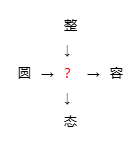

# 千字谜子题 71

## 题面

## 答案

`形`

## 解析

简单的和同开珎，整形、圆形、形容、形态

## 本地附件

- [0d50075a899145fda5563aaa42b4983c.webp](../../../assets/static.cipherpuzzles.com/static/images/0d50075a899145fda5563aaa42b4983c.webp)

来源：[https://ccbc16.cipherpuzzles.com/data/c16-qian-puzzle.json#cid=71](https://ccbc16.cipherpuzzles.com/data/c16-qian-puzzle.json#cid=71)
