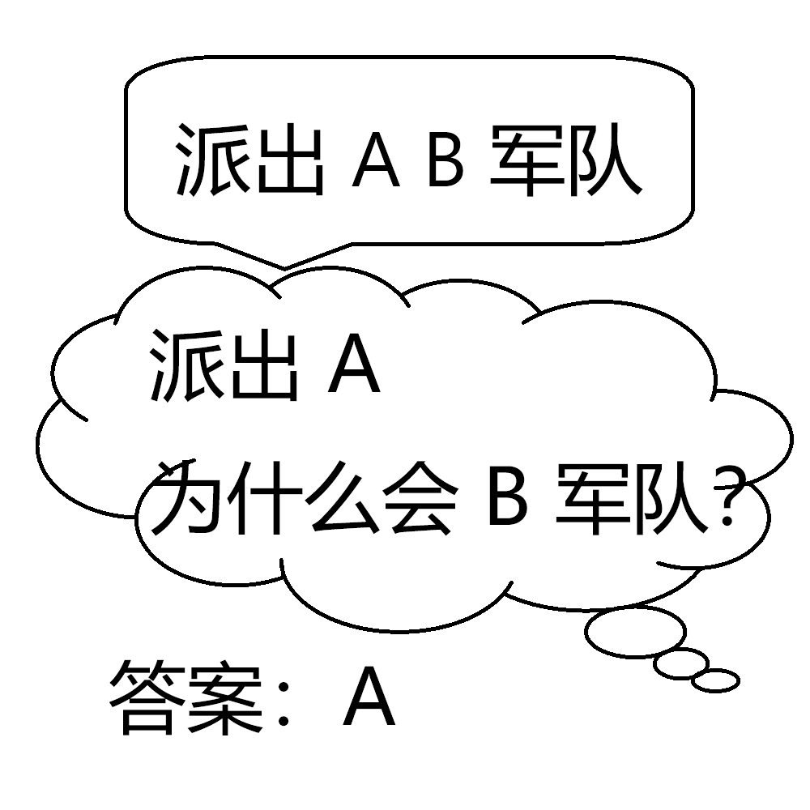

# 千字谜子题 72

## 题面

## 答案

`所`

## 解析

“派出所有军队”的不同断句

## 本地附件

- [eedbf024075e451a896d2b5090d02b5c.webp](../../../assets/static.cipherpuzzles.com/static/images/eedbf024075e451a896d2b5090d02b5c.webp)

来源：[https://ccbc16.cipherpuzzles.com/data/c16-qian-puzzle.json#cid=72](https://ccbc16.cipherpuzzles.com/data/c16-qian-puzzle.json#cid=72)
