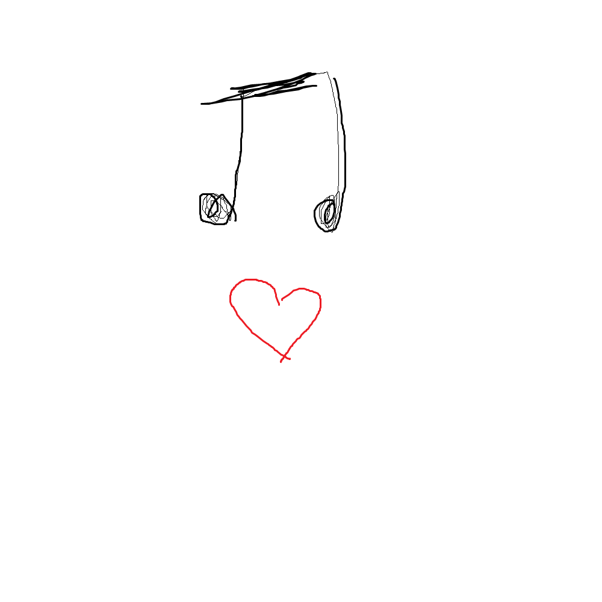

# 千字谜子题 73

## 题面

## 答案

`意`

## 解析

XX谜第一定律，看到什么就是什么

## 本地附件

- [ecdd78ab95bf41c4b4ca7c67fbf77c53.webp](../../../assets/static.cipherpuzzles.com/static/images/ecdd78ab95bf41c4b4ca7c67fbf77c53.webp)

来源：[https://ccbc16.cipherpuzzles.com/data/c16-qian-puzzle.json#cid=73](https://ccbc16.cipherpuzzles.com/data/c16-qian-puzzle.json#cid=73)
