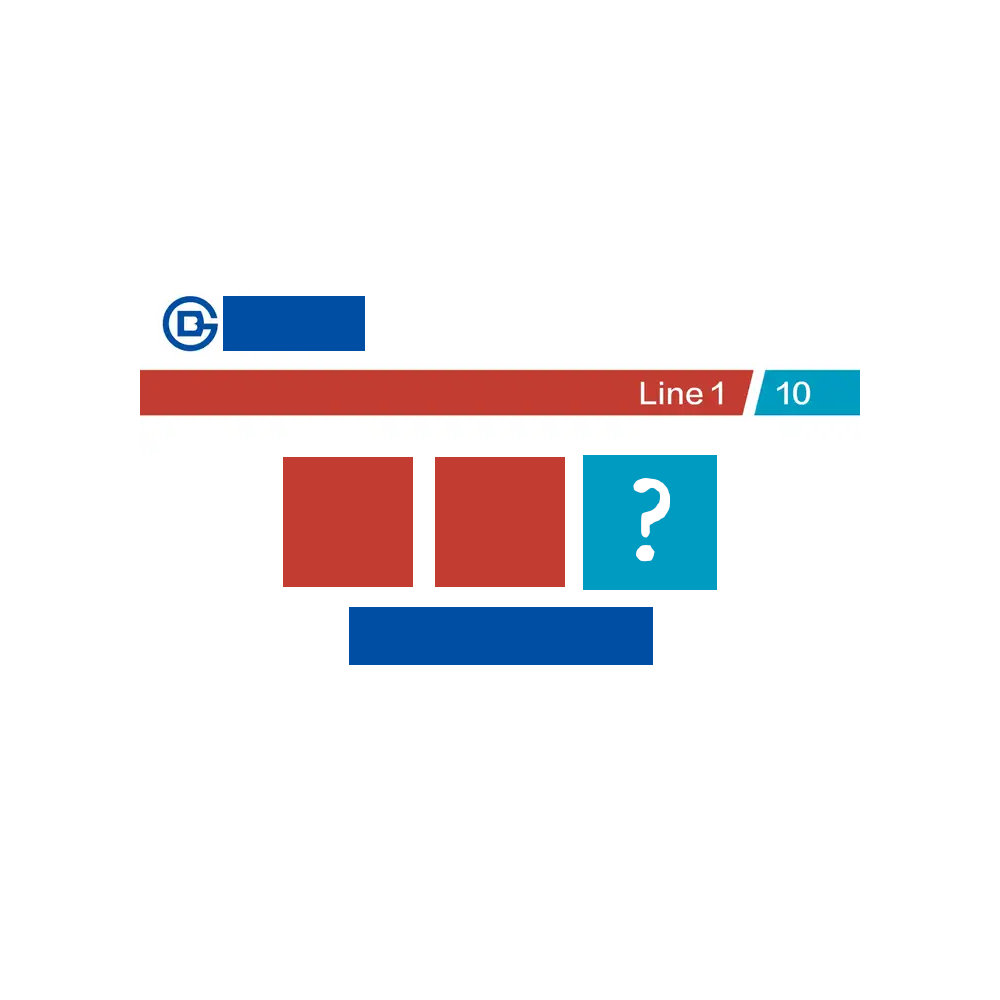

# 千字谜子题 74

## 题面

## 答案

`坟`

## 解析

由左上角图标可知北京地铁，第二行可知一号线和十号线换乘；又知一号线和十号线换乘只有国贸站和公主坟站，字数可知公主坟站。我出孬题，但是实谜，但是孬题，但是现实皆特。

## 本地附件

- [9766fe90f2cb484f9b24f52c1c57b96e.webp](../../../assets/static.cipherpuzzles.com/static/images/9766fe90f2cb484f9b24f52c1c57b96e.webp)

来源：[https://ccbc16.cipherpuzzles.com/data/c16-qian-puzzle.json#cid=74](https://ccbc16.cipherpuzzles.com/data/c16-qian-puzzle.json#cid=74)
