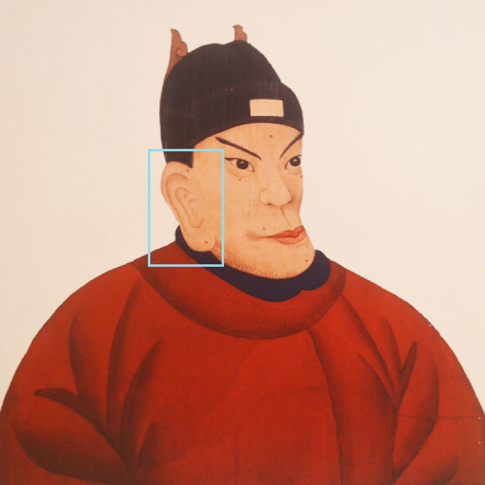

# 千字谜子题 76

## 题面

（九）

## 答案

`郡`

## 解析

朱元璋是皇帝，是“君”；图片框选的是右耳——合起来就是“郡”

## 本地附件

- [dc42b4569a194be4b7c9528a6a1d170a.webp](../../../assets/static.cipherpuzzles.com/static/images/dc42b4569a194be4b7c9528a6a1d170a.webp)

来源：[https://ccbc16.cipherpuzzles.com/data/c16-qian-puzzle.json#cid=76](https://ccbc16.cipherpuzzles.com/data/c16-qian-puzzle.json#cid=76)
