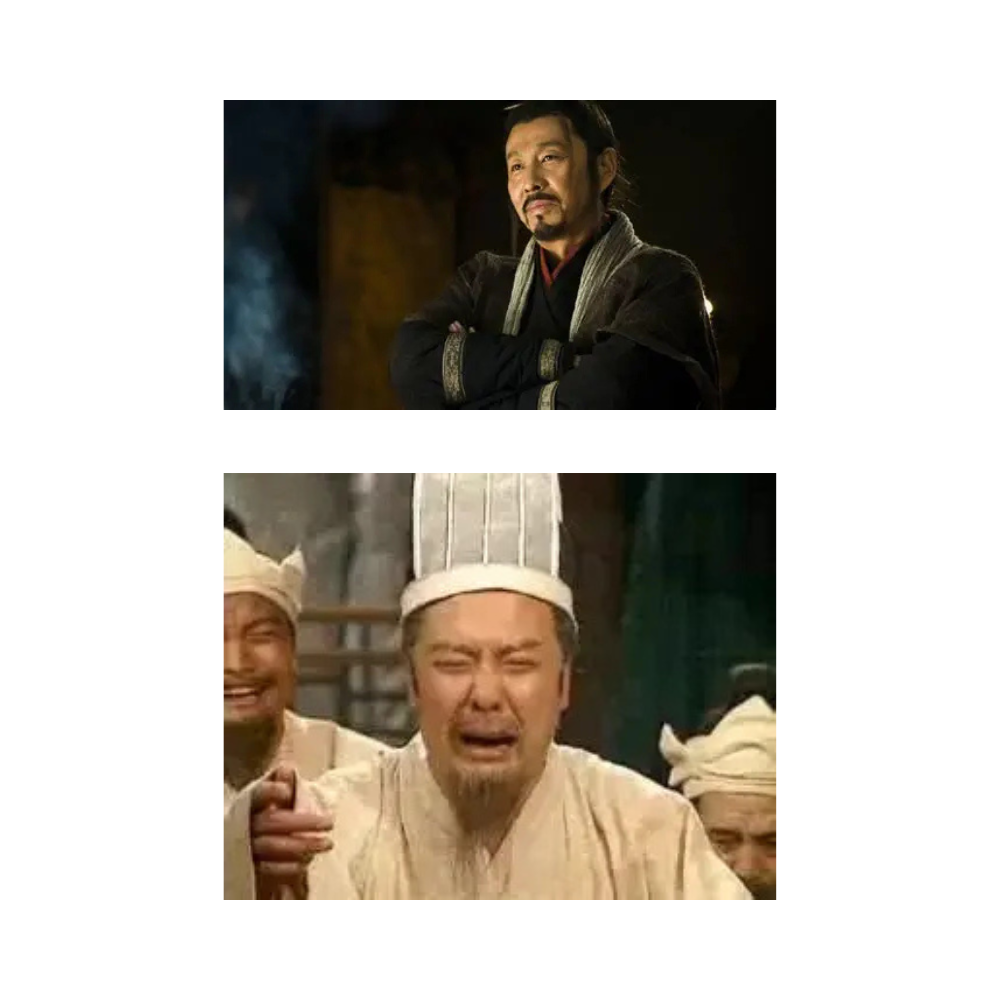

# 千字谜子题 77

## 题面

经典字谜（十四）

## 答案

`翠`

## 解析

刘邦笑了，是因为项羽死了。刘备哭了，是因为关羽死了。都是“羽卒”

## 本地附件

- [76a53db504a7408b93c721b852a7867e.webp](../../../assets/static.cipherpuzzles.com/static/images/76a53db504a7408b93c721b852a7867e.webp)

来源：[https://ccbc16.cipherpuzzles.com/data/c16-qian-puzzle.json#cid=77](https://ccbc16.cipherpuzzles.com/data/c16-qian-puzzle.json#cid=77)
