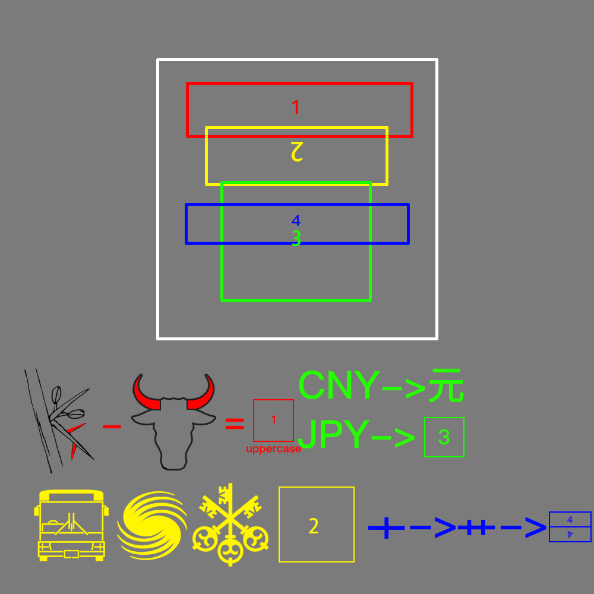

# 千字谜子题 78

## 题面

## 答案

`再`

## 解析

红色文字根据植物的刺单词（thorn）除去动物的角（horn）的英文字母得到T并大写（下方uppercase）并将其根据框中数字方向及框形状填入
黄色符号分别为公交（BUS），北京体育大学（BSU），瑞士银行（UBS），可得出为BUS的康托展开前三项，黄框应为USB，同样根据数字方向和框形状填入USB符号
绿框文字中CNY表示人民币，通常单位为“元”，而JPY表示日元，类比可填入单字“円”，同样以正确方向，形状填入
蓝框结合“十”和“艹”找规律填出一竖三横，同样以正确方式填入
填入四者后，其共同组成“再”

## 本地附件

- [817809ca1c48410db639e9b1d017e77d.webp](../../../assets/static.cipherpuzzles.com/static/images/817809ca1c48410db639e9b1d017e77d.webp)

来源：[https://ccbc16.cipherpuzzles.com/data/c16-qian-puzzle.json#cid=78](https://ccbc16.cipherpuzzles.com/data/c16-qian-puzzle.json#cid=78)
