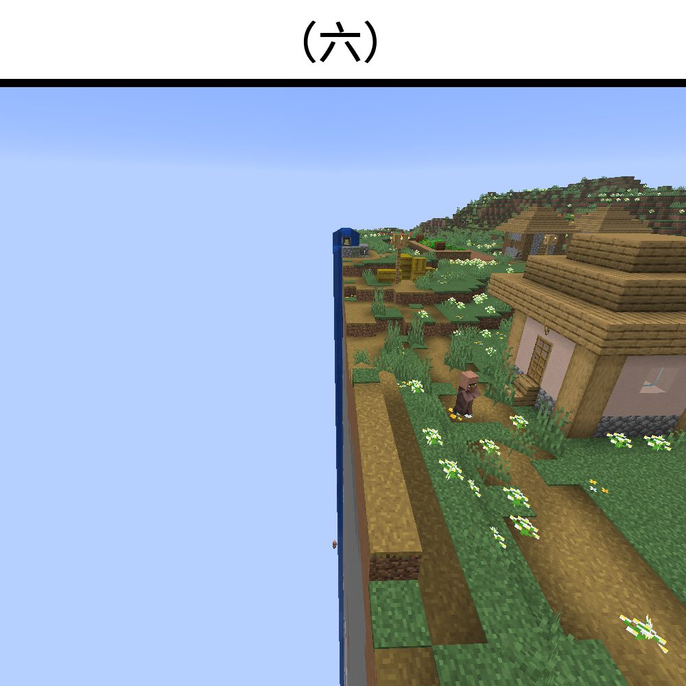

# 千字谜子题 79

## 题面

## 答案

`庄`

## 解析

图片里展示的是游戏《Minecraft》里的一处村庄（没有其他叫法），且少了左半边，因此答案是“庄”，其笔画数恰好为所提示的六画。
仔细看也可发现村庄里的庄稼也少了右半边。

## 本地附件

- [7b63027ad91f4cd9a3afb67bf794c03d.webp](../../../assets/static.cipherpuzzles.com/static/images/7b63027ad91f4cd9a3afb67bf794c03d.webp)

来源：[https://ccbc16.cipherpuzzles.com/data/c16-qian-puzzle.json#cid=79](https://ccbc16.cipherpuzzles.com/data/c16-qian-puzzle.json#cid=79)
