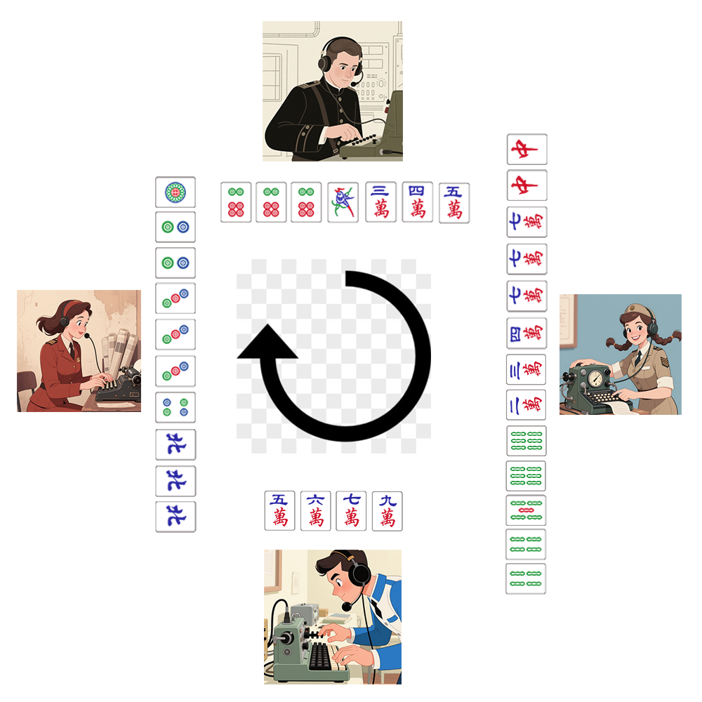

# 千字谜子题 80

## 题面

## 答案

`帝`

## 解析

4位电报员依次听牌为幺鸡-1 五条-5 九万-9 三筒-3，将1593通过中文电码转换为“帝”

## 本地附件

- [96e8b11749204dcd91947ac53c1313d3.webp](../../../assets/static.cipherpuzzles.com/static/images/96e8b11749204dcd91947ac53c1313d3.webp)

来源：[https://ccbc16.cipherpuzzles.com/data/c16-qian-puzzle.json#cid=80](https://ccbc16.cipherpuzzles.com/data/c16-qian-puzzle.json#cid=80)
