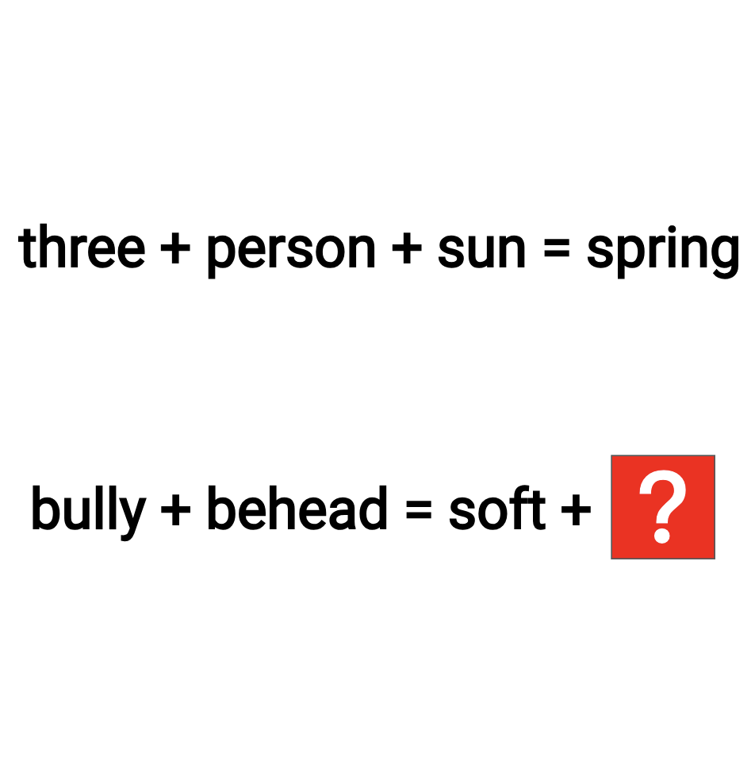

# 千字谜子题 804

## 题面

## 答案

`斯`

## 解析

_官方存档未填写解析。_

## 本地附件

- [ba5dab4468664b19ba69b3bcb37d5da5.webp](../../../assets/static.cipherpuzzles.com/static/images/ba5dab4468664b19ba69b3bcb37d5da5.webp)

来源：[https://ccbc16.cipherpuzzles.com/data/c16-qian-puzzle.json#cid=804](https://ccbc16.cipherpuzzles.com/data/c16-qian-puzzle.json#cid=804)
