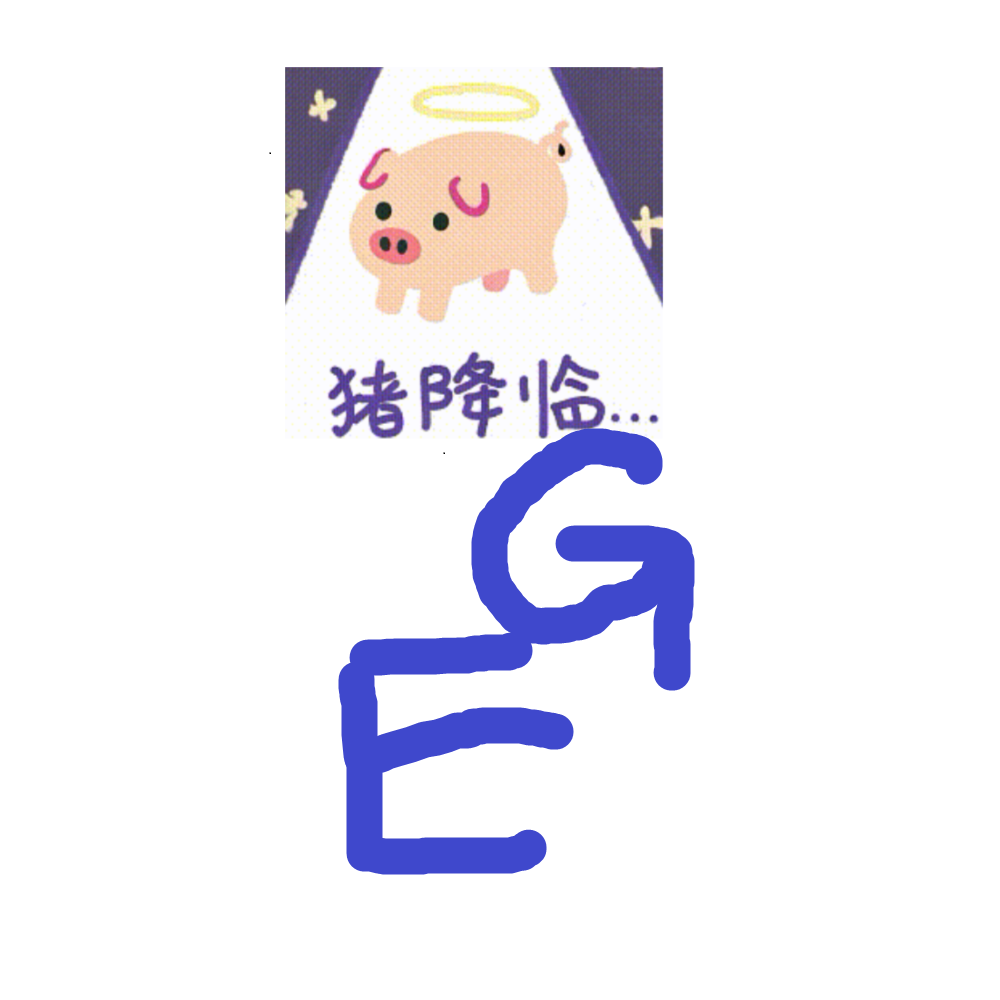

# 千字谜子题 81

## 题面

## 答案

`可`

## 解析

”猪降临“的表情包表示本体需要反向使用猪圈密码
E所代表的是”可“字正中间的口
G所代表的是”可“字右上方的横和竖钩
拼在一起可以得到本题的答案”可“

## 本地附件

- [eff123cb9f5d4b31b0bd7fc31a9c772e.webp](../../../assets/static.cipherpuzzles.com/static/images/eff123cb9f5d4b31b0bd7fc31a9c772e.webp)

来源：[https://ccbc16.cipherpuzzles.com/data/c16-qian-puzzle.json#cid=81](https://ccbc16.cipherpuzzles.com/data/c16-qian-puzzle.json#cid=81)
