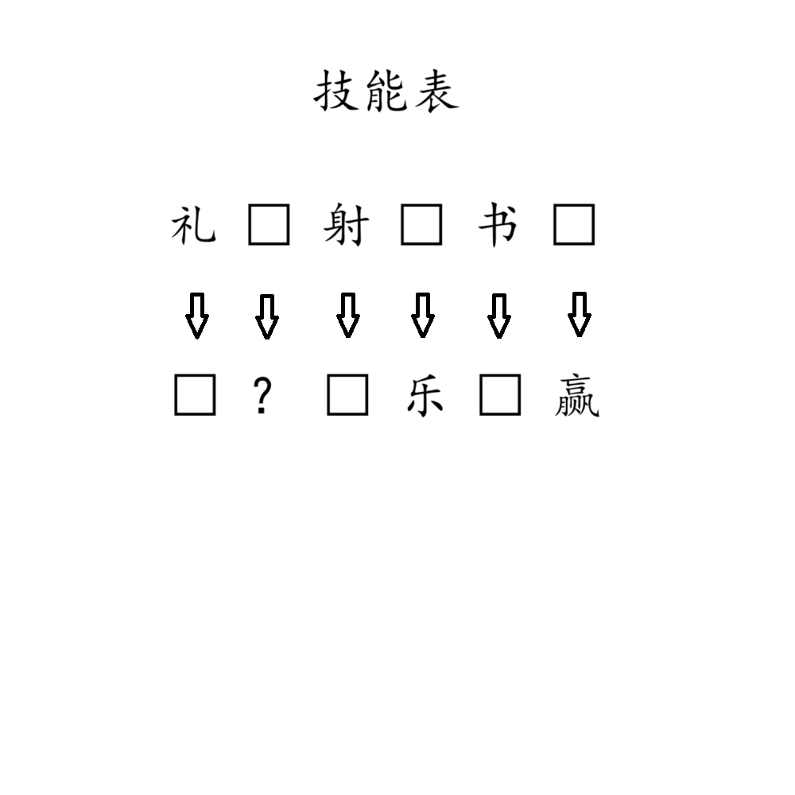

# 千字谜子题 82

## 题面

## 答案

`孝`

## 解析

题目给出了中国传统文化中的六艺以及当今的网络六艺。按照顺序提取下方问号处“孝”。

## 本地附件

- [5211e5e39c424fac971b3f2c00d2f97d.webp](../../../assets/static.cipherpuzzles.com/static/images/5211e5e39c424fac971b3f2c00d2f97d.webp)

来源：[https://ccbc16.cipherpuzzles.com/data/c16-qian-puzzle.json#cid=82](https://ccbc16.cipherpuzzles.com/data/c16-qian-puzzle.json#cid=82)
