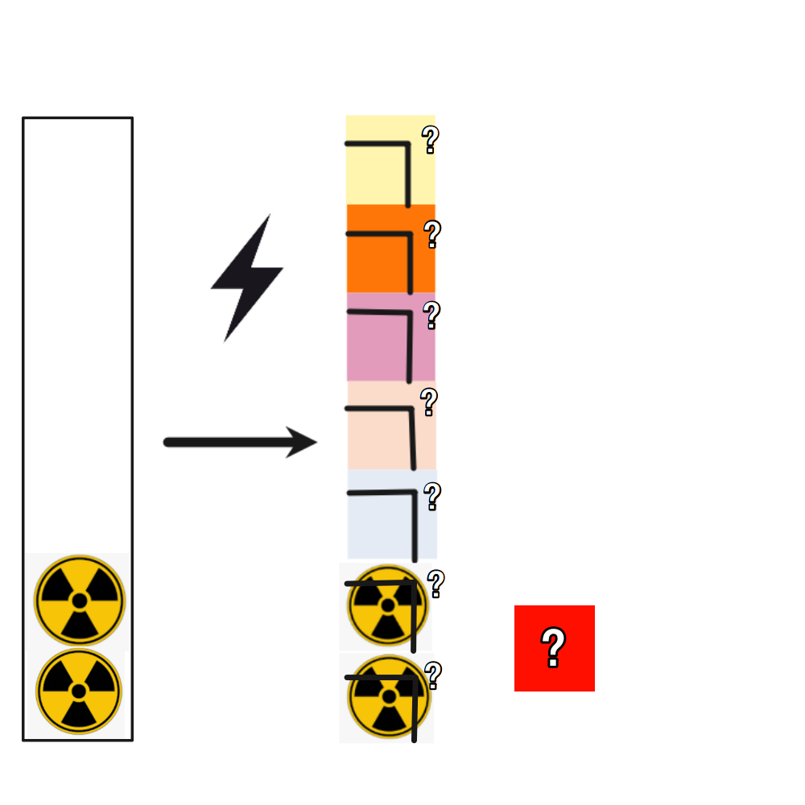

# 千字谜子题 83

## 题面

## 答案

`气`

## 解析

图中左侧展示了经过通电之后产生了不同颜色，联想到霓虹灯的颜色。经过搜索后确认是霓虹灯的颜色，取元素汉字右上角得出答案“气”。

## 本地附件

- [0bbe9dc41a104605b942bd27b192622e.webp](../../../assets/static.cipherpuzzles.com/static/images/0bbe9dc41a104605b942bd27b192622e.webp)

来源：[https://ccbc16.cipherpuzzles.com/data/c16-qian-puzzle.json#cid=83](https://ccbc16.cipherpuzzles.com/data/c16-qian-puzzle.json#cid=83)
