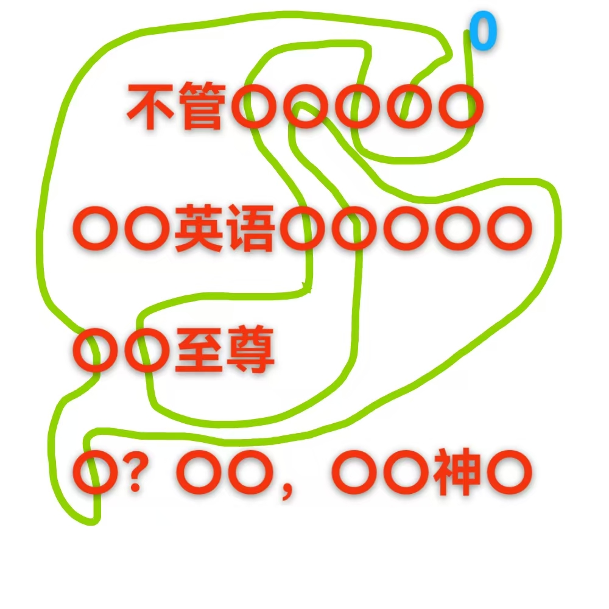

# 千字谜子题 84

## 题面

## 答案

`仙`

## 解析

从0开始，路线经过的数字递增到十，不难得到几个常用短语：不管三七二十一、大学英语四六级考试、九五自尊、八仙过海，各显神通。紫色线连接的是“考试通过！”，作为补充提示。所以问号处填“仙”

## 本地附件

- [e6ebacaa2a08430e86988d2fde896f64.webp](../../../assets/static.cipherpuzzles.com/static/images/e6ebacaa2a08430e86988d2fde896f64.webp)

来源：[https://ccbc16.cipherpuzzles.com/data/c16-qian-puzzle.json#cid=84](https://ccbc16.cipherpuzzles.com/data/c16-qian-puzzle.json#cid=84)
