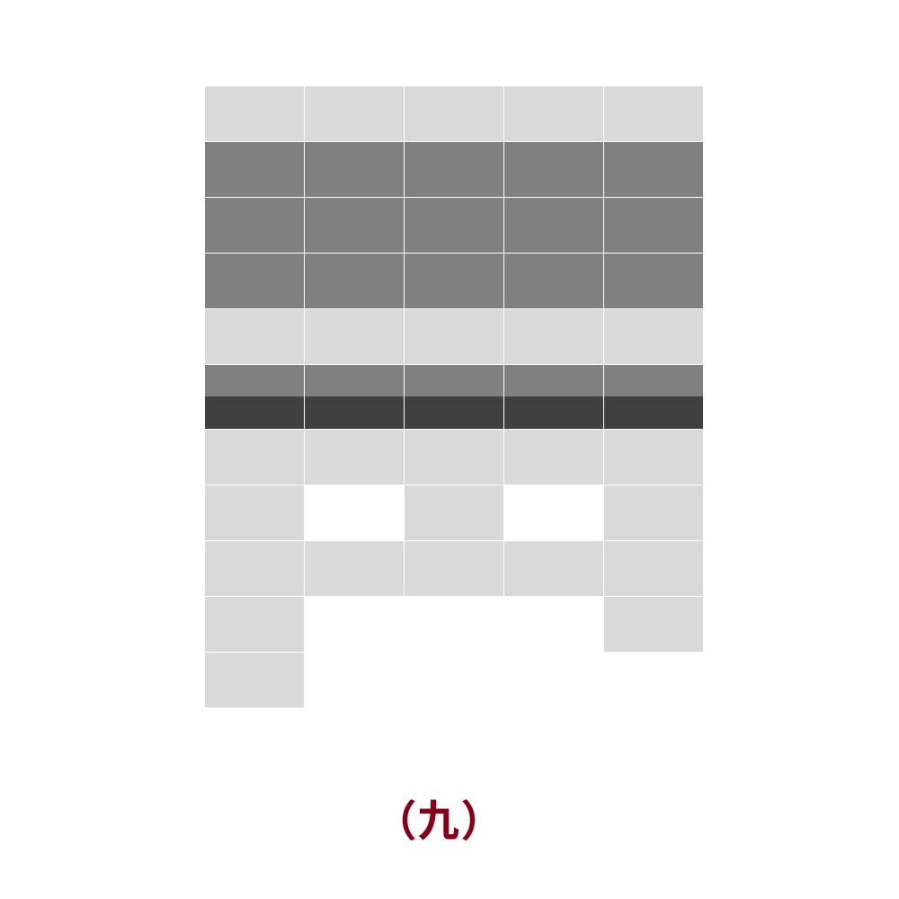

# 千字谜子题 85

## 题面

这是什么语言？标色的行有什么特别的音？

## 答案

`浊`

## 解析

表格为五十音图，深灰色的为有浊音的か行、さ行、た行、は行，其中は行再加半行深灰色表示半浊音。

## 本地附件

- [8c2fd1909a3a456f98e8f904e6c1f602.webp](../../../assets/static.cipherpuzzles.com/static/images/8c2fd1909a3a456f98e8f904e6c1f602.webp)

来源：[https://ccbc16.cipherpuzzles.com/data/c16-qian-puzzle.json#cid=85](https://ccbc16.cipherpuzzles.com/data/c16-qian-puzzle.json#cid=85)
