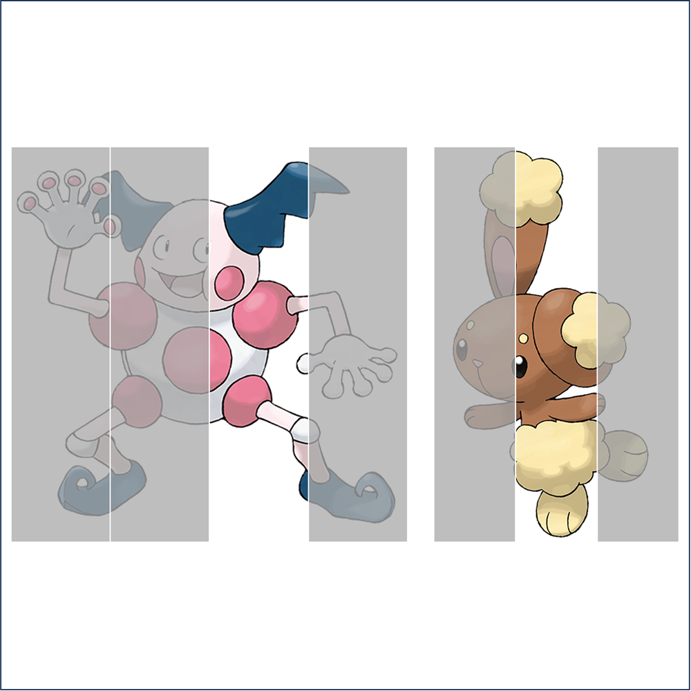

# 千字谜子题 857

## 题面

## 答案

`倦`

## 解析

_官方存档未填写解析。_

## 本地附件

- [dcd9c3d3f41647afa484fa896c735236.webp](../../../assets/static.cipherpuzzles.com/static/images/dcd9c3d3f41647afa484fa896c735236.webp)

来源：[https://ccbc16.cipherpuzzles.com/data/c16-qian-puzzle.json#cid=857](https://ccbc16.cipherpuzzles.com/data/c16-qian-puzzle.json#cid=857)
