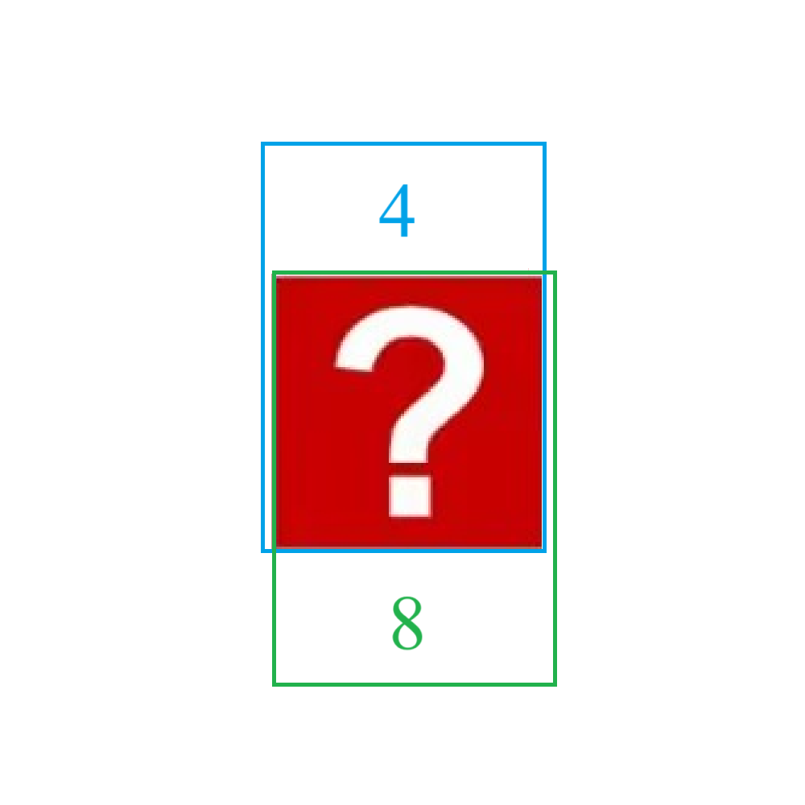

# 千字谜子题 86

## 题面

## 答案

`直`

## 解析

将阿拉伯数字转为中文数字，视作一个汉字部首。容易推出蓝框中为“置”，绿框中为“真”，可得重叠部分为“直”。

## 本地附件

- [db92860b105a488489449fdac8a2a362.webp](../../../assets/static.cipherpuzzles.com/static/images/db92860b105a488489449fdac8a2a362.webp)

来源：[https://ccbc16.cipherpuzzles.com/data/c16-qian-puzzle.json#cid=86](https://ccbc16.cipherpuzzles.com/data/c16-qian-puzzle.json#cid=86)
