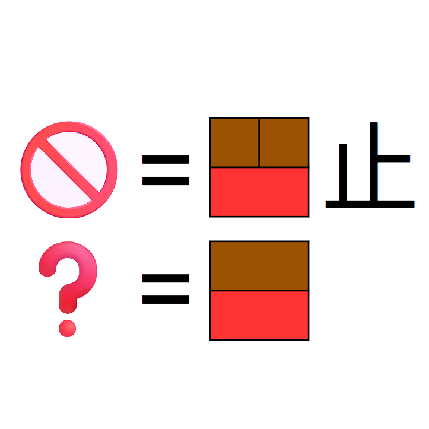

# 千字谜子题 860

## 题面

## 答案

`柰`

## 解析

🚫为禁止，棕色为木，红色为示，下方❓为答案柰

## 本地附件

- [baf2e968b02d4b5a964645da8e3ac927.webp](../../../assets/static.cipherpuzzles.com/static/images/baf2e968b02d4b5a964645da8e3ac927.webp)

来源：[https://ccbc16.cipherpuzzles.com/data/c16-qian-puzzle.json#cid=860](https://ccbc16.cipherpuzzles.com/data/c16-qian-puzzle.json#cid=860)
