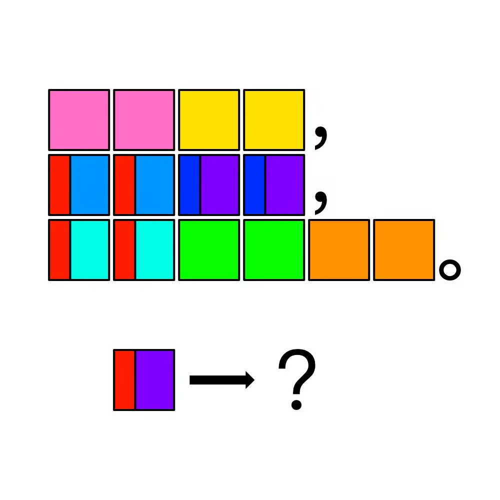

# 千字谜子题 867

## 题面

## 答案

`凊`

## 解析

寻寻觅觅冷冷清清凄凄惨惨戚戚

## 本地附件

- [5359d2d457d14a7d94f7f9fdc838b2b0.webp](../../../assets/static.cipherpuzzles.com/static/images/5359d2d457d14a7d94f7f9fdc838b2b0.webp)

来源：[https://ccbc16.cipherpuzzles.com/data/c16-qian-puzzle.json#cid=867](https://ccbc16.cipherpuzzles.com/data/c16-qian-puzzle.json#cid=867)
