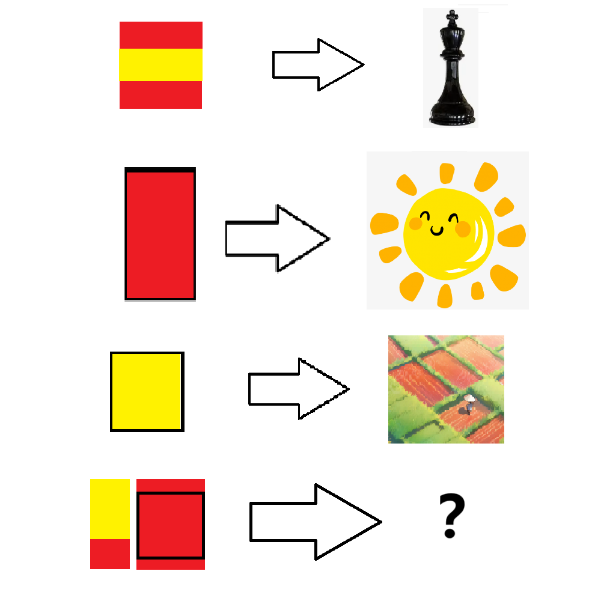

# 千字谜子题 87

## 题面

## 答案

`垣`

## 解析

红色区域代表“一”，黄色区域代表"十"，黑色方框代表“口”
从上到下分别是：
王  日  田
填入最后一行，可以得到答案为“垣”

## 本地附件

- [b845ce99bf1048cc9a6f95d80e153dfd.webp](../../../assets/static.cipherpuzzles.com/static/images/b845ce99bf1048cc9a6f95d80e153dfd.webp)

来源：[https://ccbc16.cipherpuzzles.com/data/c16-qian-puzzle.json#cid=87](https://ccbc16.cipherpuzzles.com/data/c16-qian-puzzle.json#cid=87)
