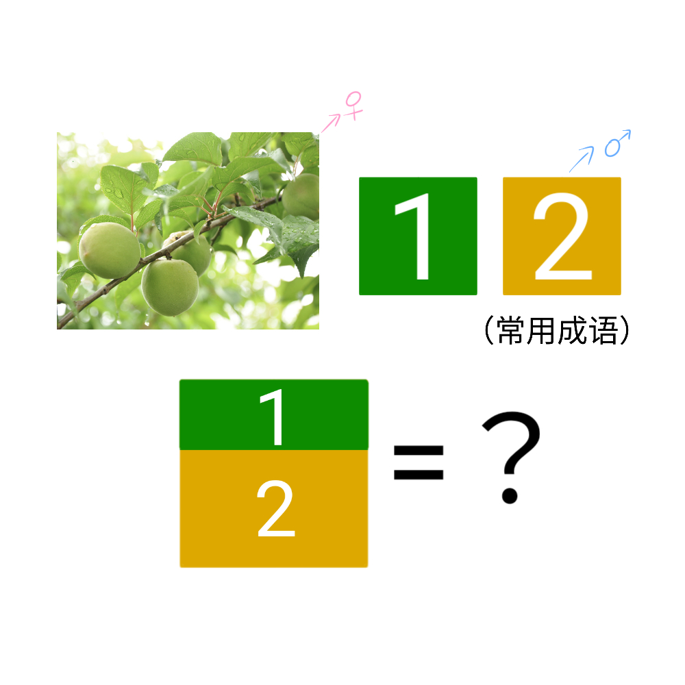

# 千字谜子题 871

## 题面

## 答案

`笃`

## 解析

_官方存档未填写解析。_

## 本地附件

- [28efd032953343799fe445e90739a876.webp](../../../assets/static.cipherpuzzles.com/static/images/28efd032953343799fe445e90739a876.webp)

来源：[https://ccbc16.cipherpuzzles.com/data/c16-qian-puzzle.json#cid=871](https://ccbc16.cipherpuzzles.com/data/c16-qian-puzzle.json#cid=871)
