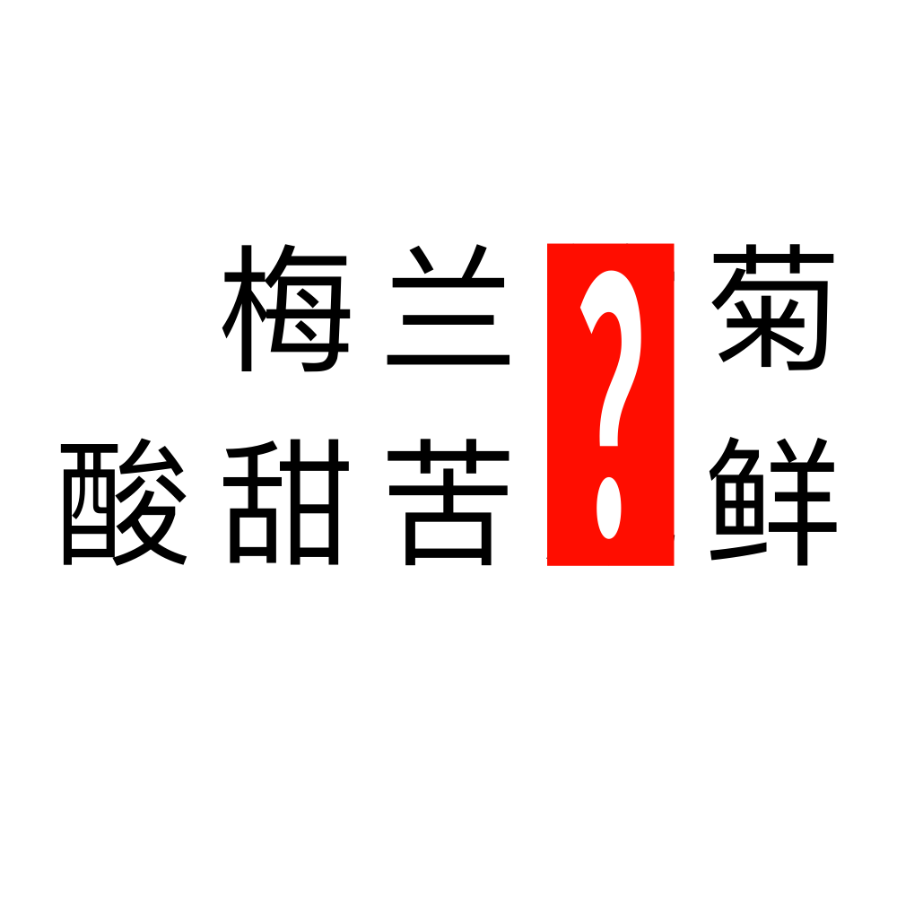

# 千字谜子题 874

## 题面

## 答案

`箴`

## 解析

_官方存档未填写解析。_

## 本地附件

- [c63c91ac02054edf9b7bedb178a1a199.webp](../../../assets/static.cipherpuzzles.com/static/images/c63c91ac02054edf9b7bedb178a1a199.webp)

来源：[https://ccbc16.cipherpuzzles.com/data/c16-qian-puzzle.json#cid=874](https://ccbc16.cipherpuzzles.com/data/c16-qian-puzzle.json#cid=874)
