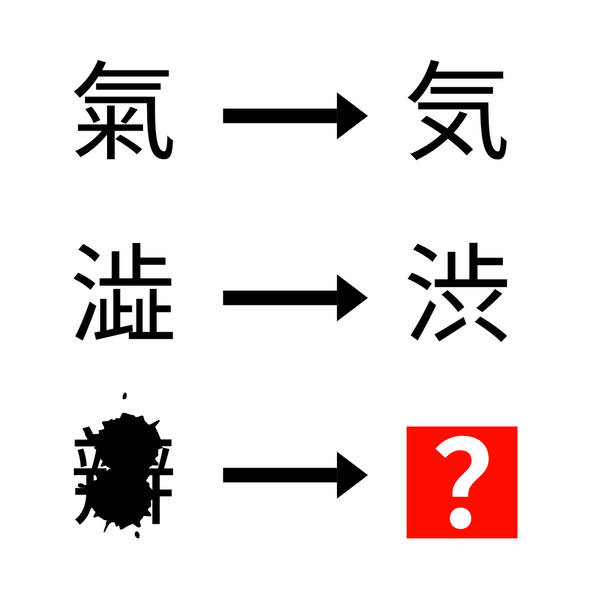

# 千字谜子题 875

## 题面

## 答案

`弁`

## 解析

由前两行可以得到本题的规律是日本旧字体→日本新字体，最后一行的字虽然部分被墨水遮住，但辨，瓣，辯对应的新字体均为弁，于是答案为弁

## 本地附件

- [2e6bd8803e184bcb9a36a4de331e2f15.webp](../../../assets/static.cipherpuzzles.com/static/images/2e6bd8803e184bcb9a36a4de331e2f15.webp)

来源：[https://ccbc16.cipherpuzzles.com/data/c16-qian-puzzle.json#cid=875](https://ccbc16.cipherpuzzles.com/data/c16-qian-puzzle.json#cid=875)
