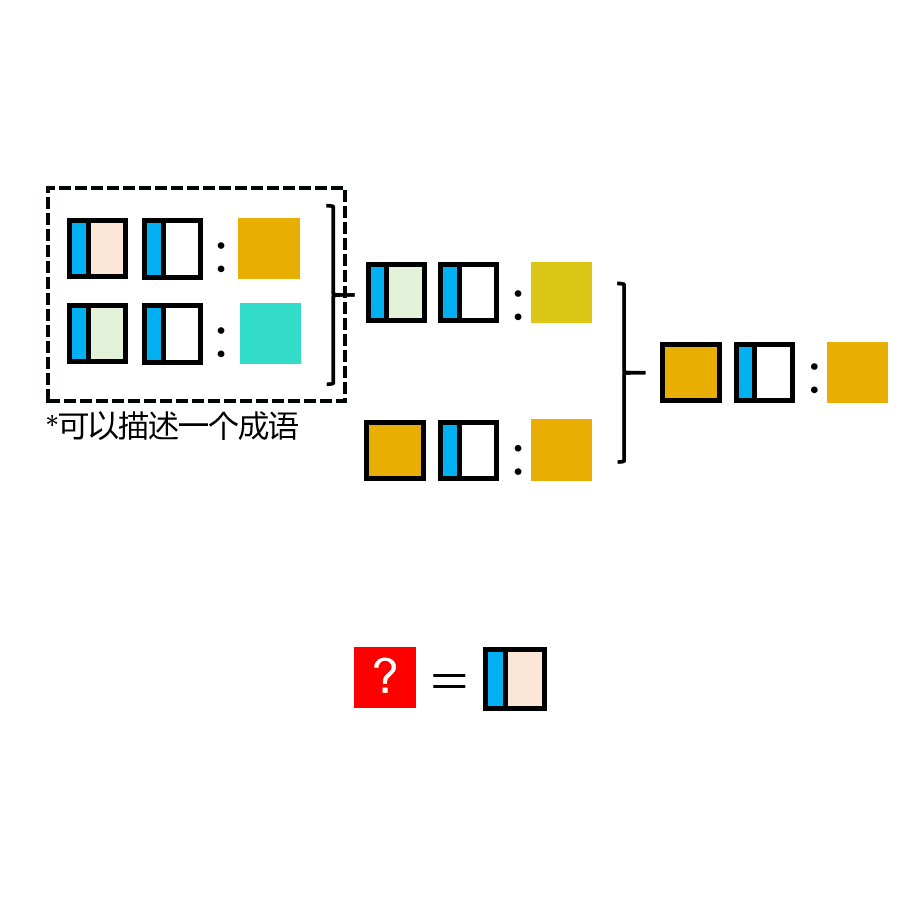

# 千字谜子题 877

## 题面

## 答案

`泾`

## 解析

切入点为大量的蓝色部首，可猜测为“氵”。之后可以联想到“黄河：黄”并意识到冒号前后分别为河流和河水颜色，大括号表示支流汇入干流情况。倒推会最左侧可知分别为“泾河：浊”和：“渭河：清”，成语为“泾渭分明”。故答案为“泾”

## 本地附件

- [2a4848a18d724656b9249dff12b408e0.webp](../../../assets/static.cipherpuzzles.com/static/images/2a4848a18d724656b9249dff12b408e0.webp)

来源：[https://ccbc16.cipherpuzzles.com/data/c16-qian-puzzle.json#cid=877](https://ccbc16.cipherpuzzles.com/data/c16-qian-puzzle.json#cid=877)
