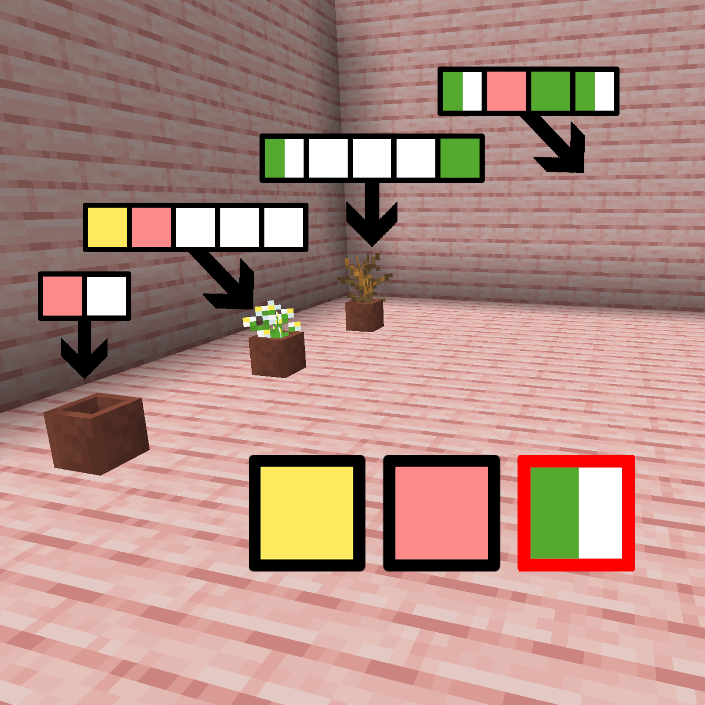

# 千字谜子题 879

## 题面

## 答案

`楹`

## 解析

从左至右分别对应：花盆、蓝花美耳草、枯萎的灌木、樱花木板，提取对应部件后可组成 蓝 花 [⿰木X]，对应“蓝花楹”，答案为楹

## 本地附件

- [d23fcca698e1445abe50b694e48691d2.webp](../../../assets/static.cipherpuzzles.com/static/images/d23fcca698e1445abe50b694e48691d2.webp)

来源：[https://ccbc16.cipherpuzzles.com/data/c16-qian-puzzle.json#cid=879](https://ccbc16.cipherpuzzles.com/data/c16-qian-puzzle.json#cid=879)
