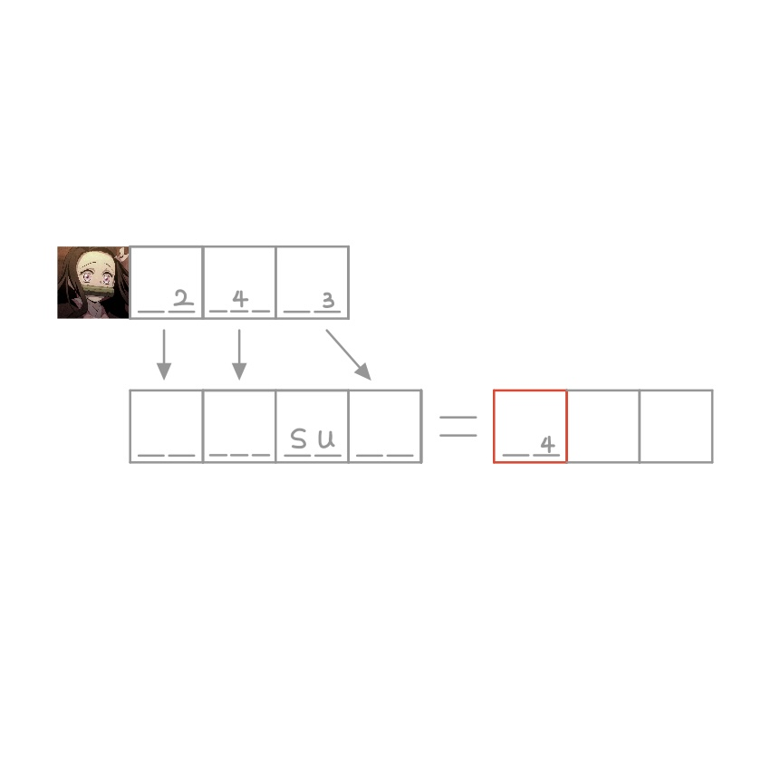

# 千字谜子题 88

## 题面

## 答案

`御`

## 解析

由图片（鬼灭之刃中的灶门祢豆子）及最上方三格中“2 4 3”音调提示可知三个对应格中应填“mi dou zi”，进而得到“midousuzi”，从日语罗马音转译回中文得到“御堂筋”（飙速宅男中的御堂筋翔），与音调提示和署名中中自行车的emoji相呼应，标红格子中的“御”即为答案。

## 本地附件

- [e95d538319a64b11a251e5441851f7c9.webp](../../../assets/static.cipherpuzzles.com/static/images/e95d538319a64b11a251e5441851f7c9.webp)

来源：[https://ccbc16.cipherpuzzles.com/data/c16-qian-puzzle.json#cid=88](https://ccbc16.cipherpuzzles.com/data/c16-qian-puzzle.json#cid=88)
