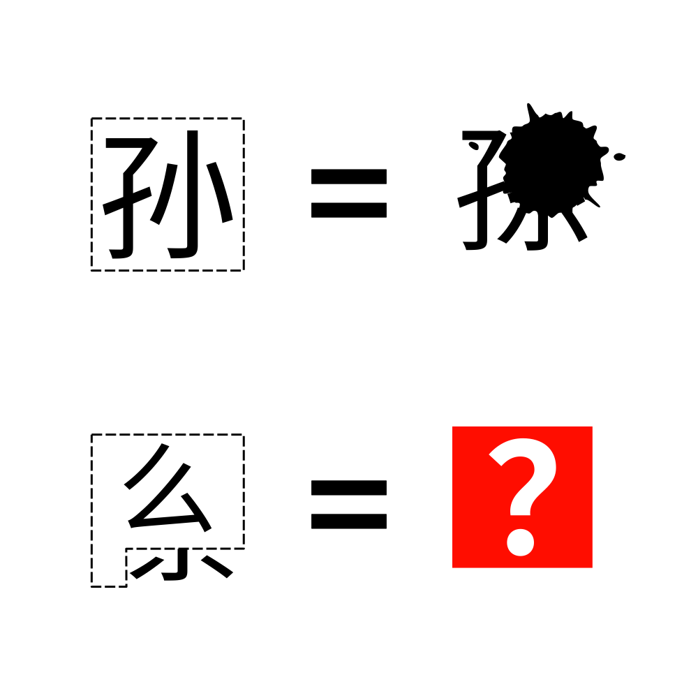

# 千字谜子题 881

## 题面

## 答案

`縻`

## 解析

_官方存档未填写解析。_

## 本地附件

- [dc1c156f9c944d5fbd69e2003ca15f13.webp](../../../assets/static.cipherpuzzles.com/static/images/dc1c156f9c944d5fbd69e2003ca15f13.webp)

来源：[https://ccbc16.cipherpuzzles.com/data/c16-qian-puzzle.json#cid=881](https://ccbc16.cipherpuzzles.com/data/c16-qian-puzzle.json#cid=881)
