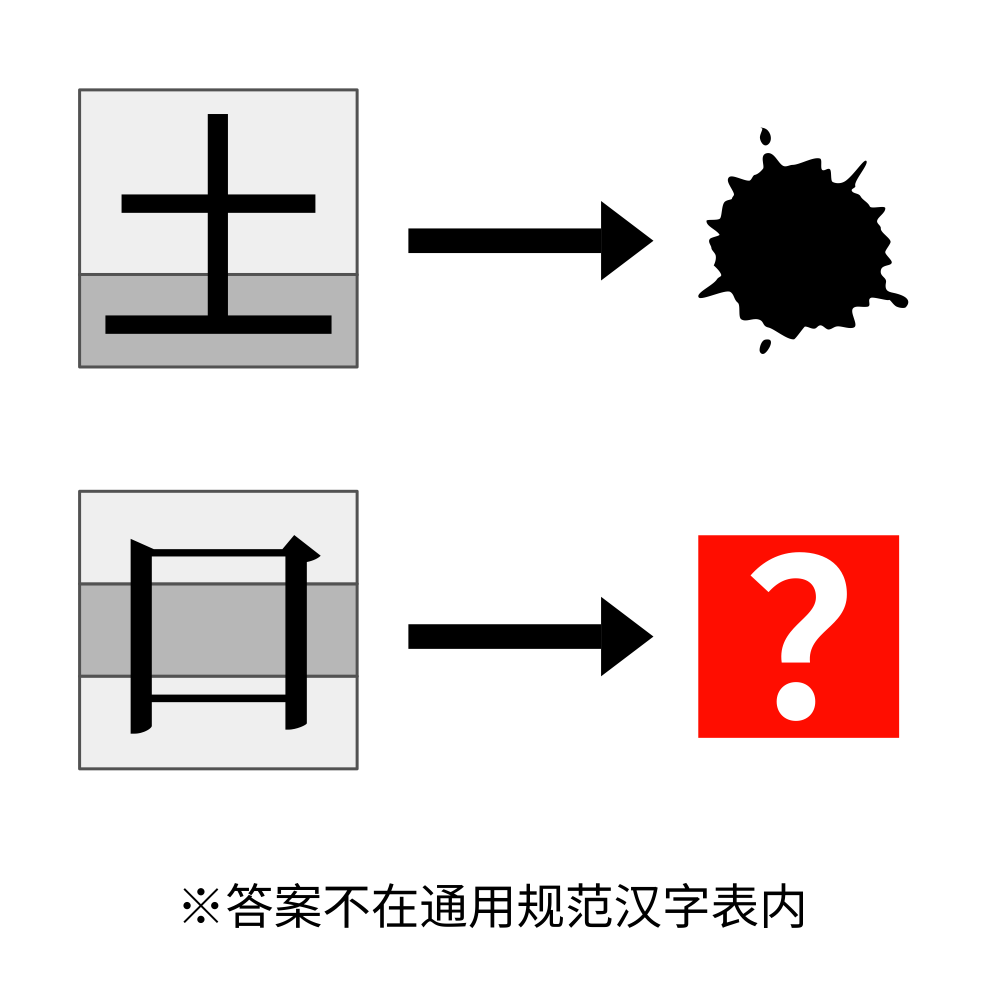

# 千字谜子题 883

## 题面

## 答案

`宲`

## 解析

_官方存档未填写解析。_

## 本地附件

- [90f148cf84974bddb0120a7704386319.webp](../../../assets/static.cipherpuzzles.com/static/images/90f148cf84974bddb0120a7704386319.webp)

来源：[https://ccbc16.cipherpuzzles.com/data/c16-qian-puzzle.json#cid=883](https://ccbc16.cipherpuzzles.com/data/c16-qian-puzzle.json#cid=883)
