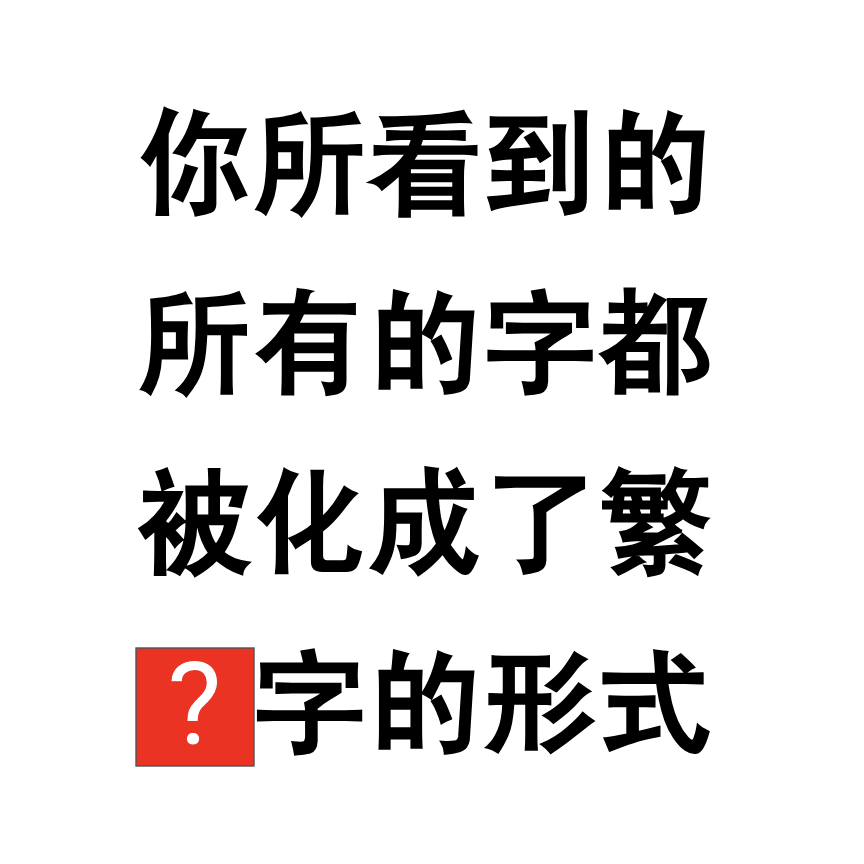

# 千字谜子题 884

## 题面

## 答案

`體`

## 解析

你所看到的所有的字都被化成了繁體字的形式。这句话中只有“體”繁简不同

## 本地附件

- [4ddb2fb1bf1648b3a42a4e2becfc65d1.webp](../../../assets/static.cipherpuzzles.com/static/images/4ddb2fb1bf1648b3a42a4e2becfc65d1.webp)

来源：[https://ccbc16.cipherpuzzles.com/data/c16-qian-puzzle.json#cid=884](https://ccbc16.cipherpuzzles.com/data/c16-qian-puzzle.json#cid=884)
