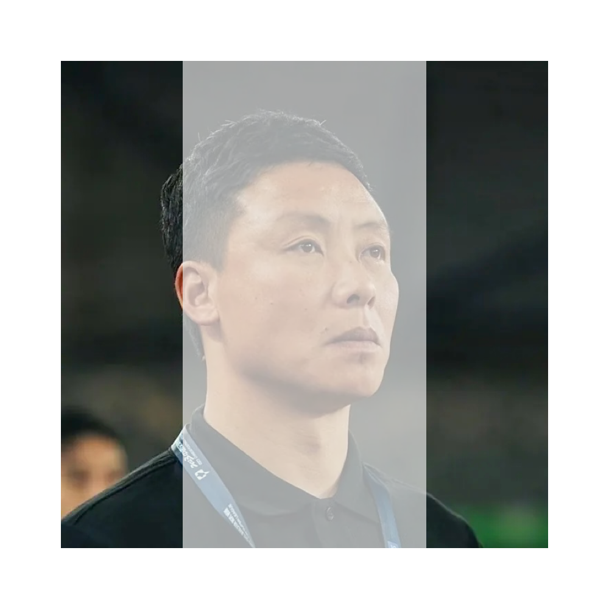

# 千字谜子题 885

## 题面

## 答案

`陦`

## 解析

识图得到人物为“陈涛”，取两边的部件组合得到“陦”

## 本地附件

- [0b55b5770fb148e78a4e9fc6ebce0e2f.webp](../../../assets/static.cipherpuzzles.com/static/images/0b55b5770fb148e78a4e9fc6ebce0e2f.webp)

来源：[https://ccbc16.cipherpuzzles.com/data/c16-qian-puzzle.json#cid=885](https://ccbc16.cipherpuzzles.com/data/c16-qian-puzzle.json#cid=885)
