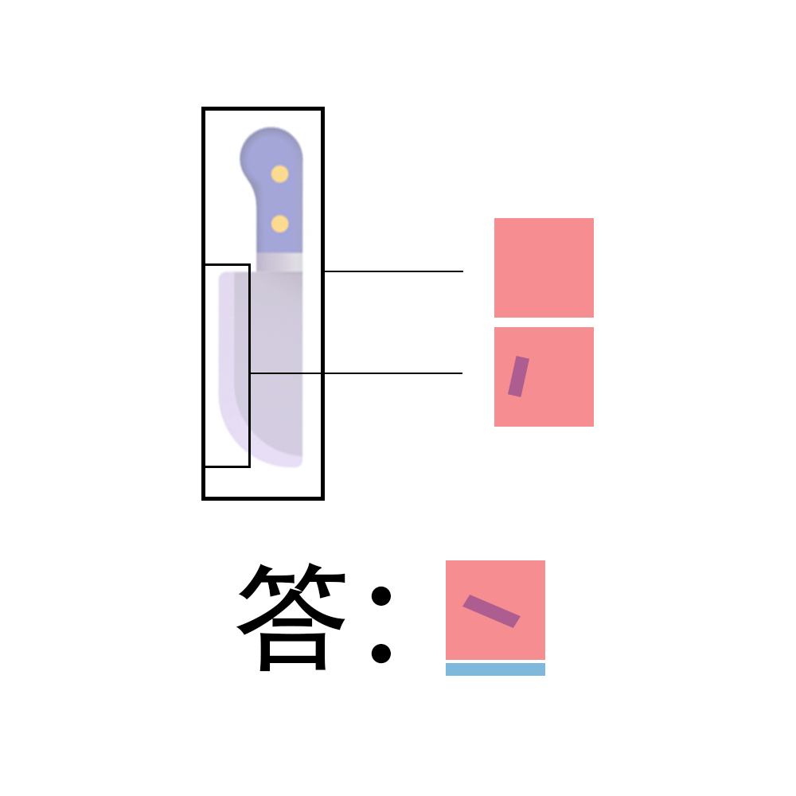

# 千字谜子题 888

## 题面

## 答案

`丒`

## 解析

图表示的字是刀和刃。红色是刀，蓝色是横杠，紫色由红和蓝叠加产生。答案是丒。

## 本地附件

- [084494d9e0074b6d94896e7d346d9757.png](../../../assets/static.cipherpuzzles.com/static/images/084494d9e0074b6d94896e7d346d9757.png)

来源：[https://ccbc16.cipherpuzzles.com/data/c16-qian-puzzle.json#cid=888](https://ccbc16.cipherpuzzles.com/data/c16-qian-puzzle.json#cid=888)
