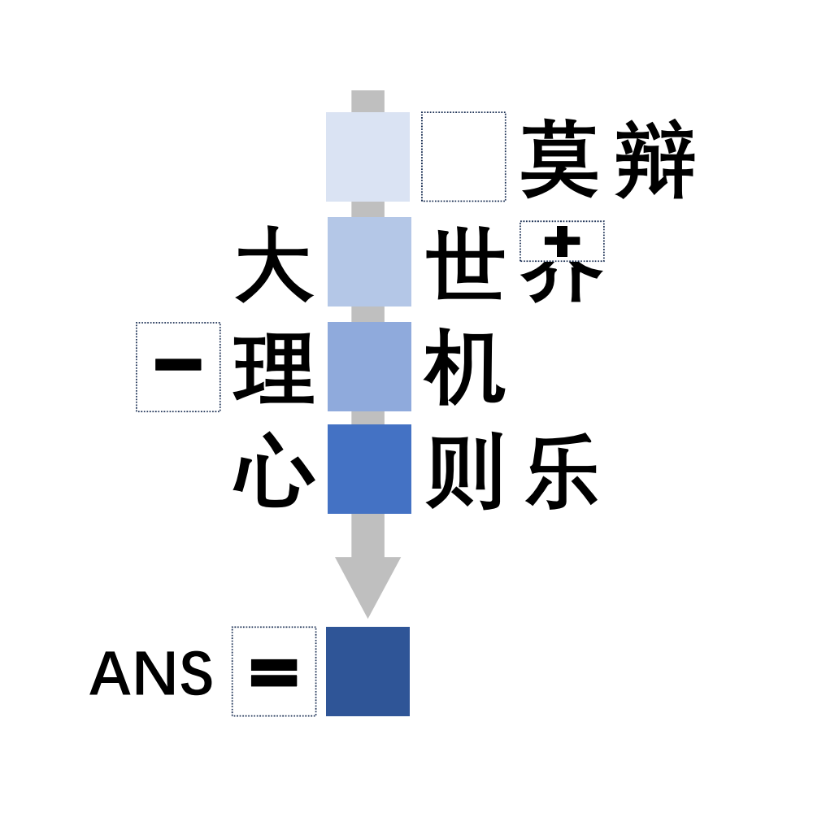

# 千字谜子题 89

## 题面

## 答案

`眺`

## 解析

虚线框=口，箭头为百千万亿兆，目+兆=眺

## 本地附件

- [b8623cae1784428083585a8ed486d66a.webp](../../../assets/static.cipherpuzzles.com/static/images/b8623cae1784428083585a8ed486d66a.webp)

来源：[https://ccbc16.cipherpuzzles.com/data/c16-qian-puzzle.json#cid=89](https://ccbc16.cipherpuzzles.com/data/c16-qian-puzzle.json#cid=89)
