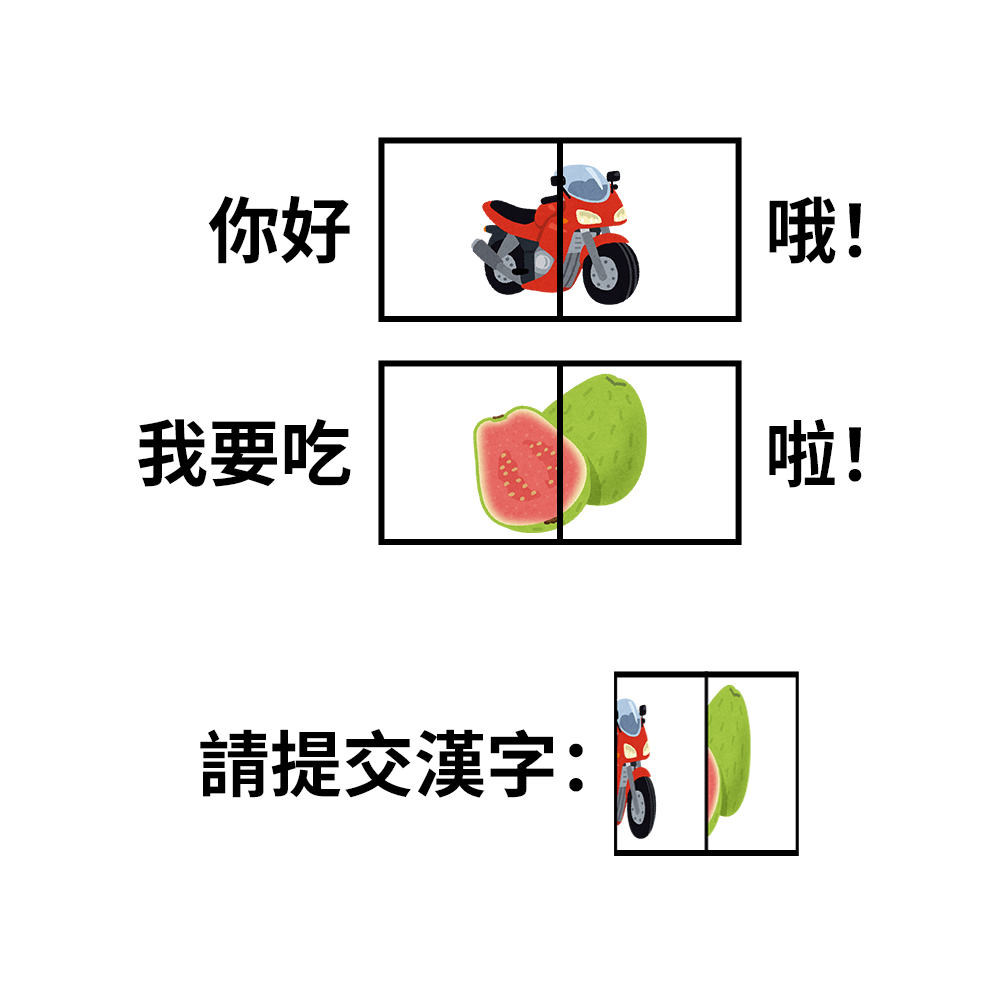

# 千字谜子题 891

## 题面

## 答案

`轢`

## 解析

_官方存档未填写解析。_

## 本地附件

- [11fd812a86fc45b294447aabf131190b.webp](../../../assets/static.cipherpuzzles.com/static/images/11fd812a86fc45b294447aabf131190b.webp)

来源：[https://ccbc16.cipherpuzzles.com/data/c16-qian-puzzle.json#cid=891](https://ccbc16.cipherpuzzles.com/data/c16-qian-puzzle.json#cid=891)
