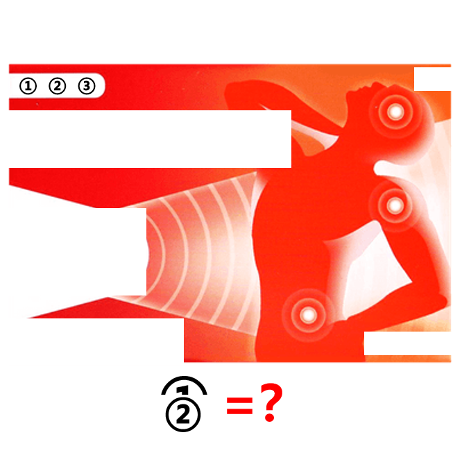

# 千字谜子题 894

## 题面

## 答案

`苾`

## 解析

_官方存档未填写解析。_

## 本地附件

- [9abcbd2a916c42278235dc72a2095a5e.webp](../../../assets/static.cipherpuzzles.com/static/images/9abcbd2a916c42278235dc72a2095a5e.webp)

来源：[https://ccbc16.cipherpuzzles.com/data/c16-qian-puzzle.json#cid=894](https://ccbc16.cipherpuzzles.com/data/c16-qian-puzzle.json#cid=894)
