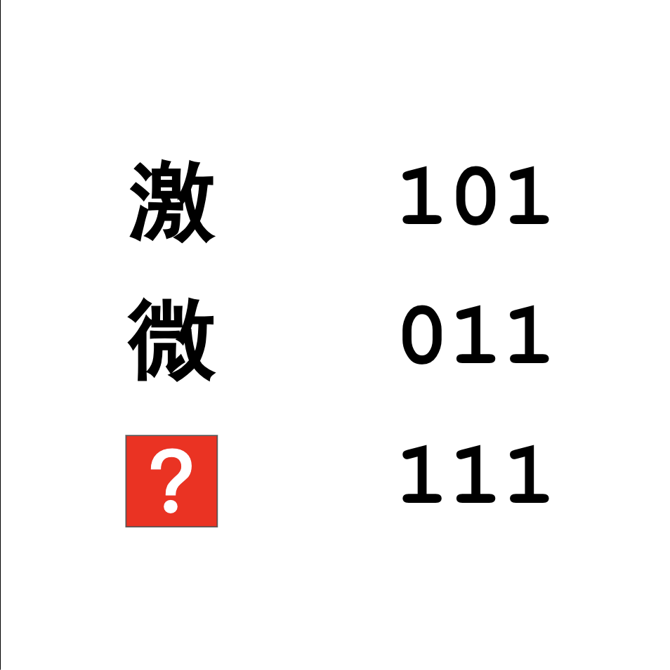

# 千字谜子题 897

## 题面

## 答案

`溦`

## 解析

_官方存档未填写解析。_

## 本地附件

- [57bd669ce19948f7b8666aebc3a3bcda.webp](../../../assets/static.cipherpuzzles.com/static/images/57bd669ce19948f7b8666aebc3a3bcda.webp)

来源：[https://ccbc16.cipherpuzzles.com/data/c16-qian-puzzle.json#cid=897](https://ccbc16.cipherpuzzles.com/data/c16-qian-puzzle.json#cid=897)
