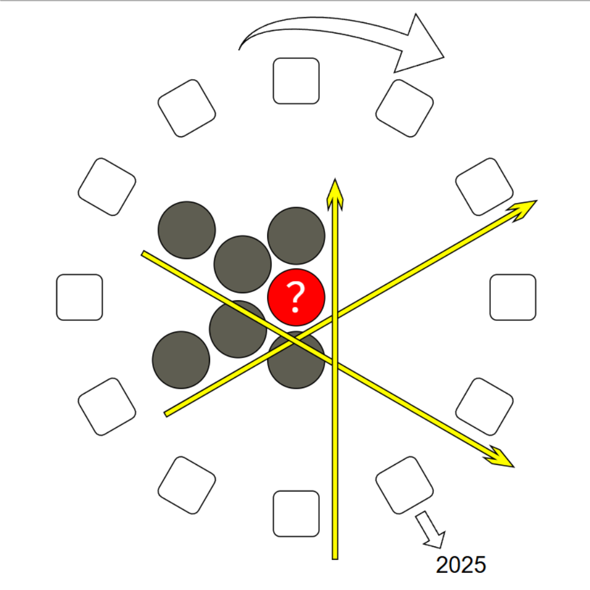

# 千字谜子题 90

## 题面

## 答案

`成`

## 解析

共有12个围成圈呈循环状的方框，且第6个标注有“2025”，容易联想到为12生肖，第6个为“蛇”。三个黄色箭头代表顺序成词，分别为“三人成虎”、“望子成龙”和“马到成功”，得到问号处为“成”。

## 本地附件

- [bbe339afa16643e1942b0e8b83380a1d.webp](../../../assets/static.cipherpuzzles.com/static/images/bbe339afa16643e1942b0e8b83380a1d.webp)

来源：[https://ccbc16.cipherpuzzles.com/data/c16-qian-puzzle.json#cid=90](https://ccbc16.cipherpuzzles.com/data/c16-qian-puzzle.json#cid=90)
