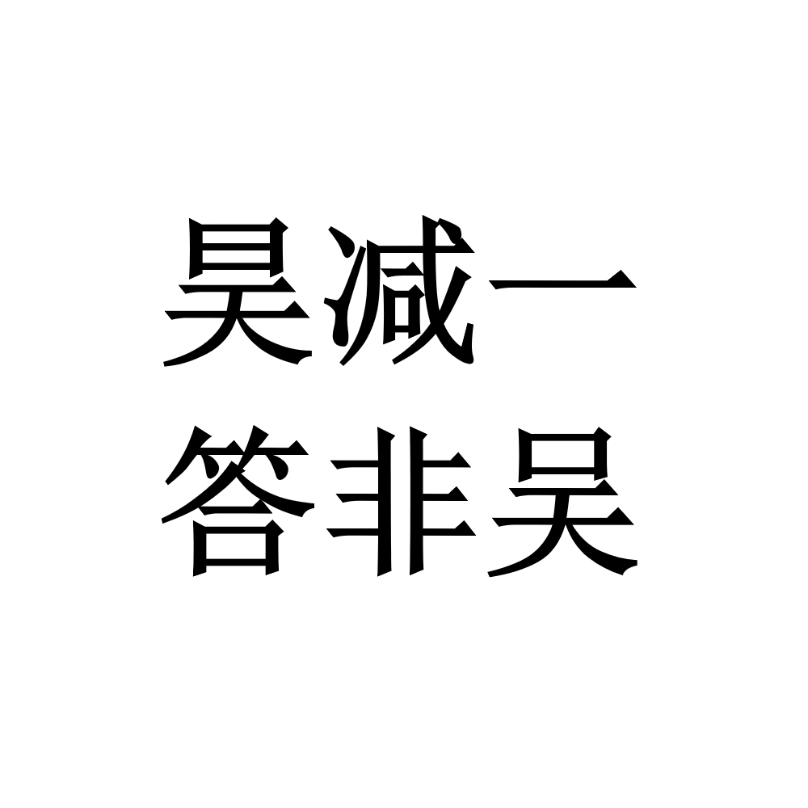

# 千字谜子题 901

## 题面

## 答案

`旲`

## 解析

题面提示将“昊”字减一笔，但答案不是“吴”，经过一些尝试可以得到答案为“旲”。

## 本地附件

- [d30eca8257264a6e85d42f71f11d3500.webp](../../../assets/static.cipherpuzzles.com/static/images/d30eca8257264a6e85d42f71f11d3500.webp)

来源：[https://ccbc16.cipherpuzzles.com/data/c16-qian-puzzle.json#cid=901](https://ccbc16.cipherpuzzles.com/data/c16-qian-puzzle.json#cid=901)
