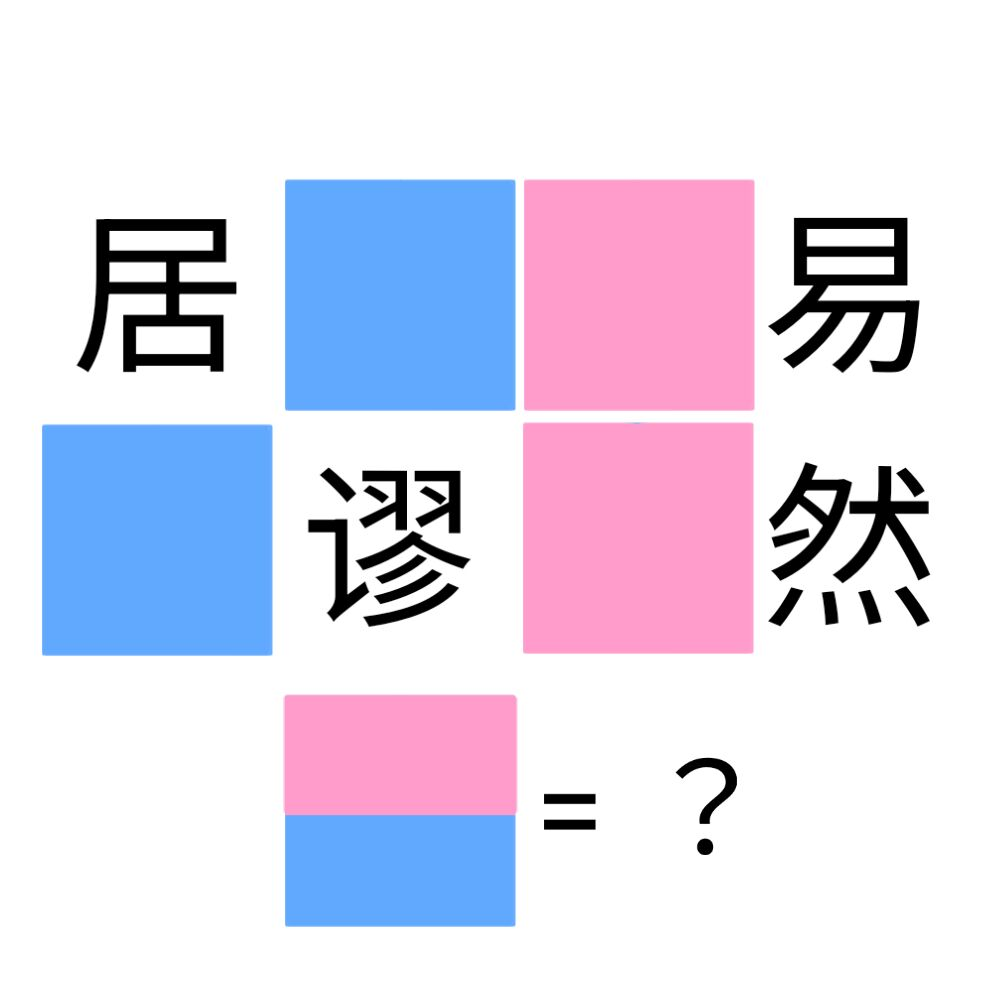

# 千字谜子题 903

## 题面

## 答案

`奀`

## 解析

_官方存档未填写解析。_

## 本地附件

- [25cc0bf4ab434b54a68c23b0ee91691c.webp](../../../assets/static.cipherpuzzles.com/static/images/25cc0bf4ab434b54a68c23b0ee91691c.webp)

来源：[https://ccbc16.cipherpuzzles.com/data/c16-qian-puzzle.json#cid=903](https://ccbc16.cipherpuzzles.com/data/c16-qian-puzzle.json#cid=903)
