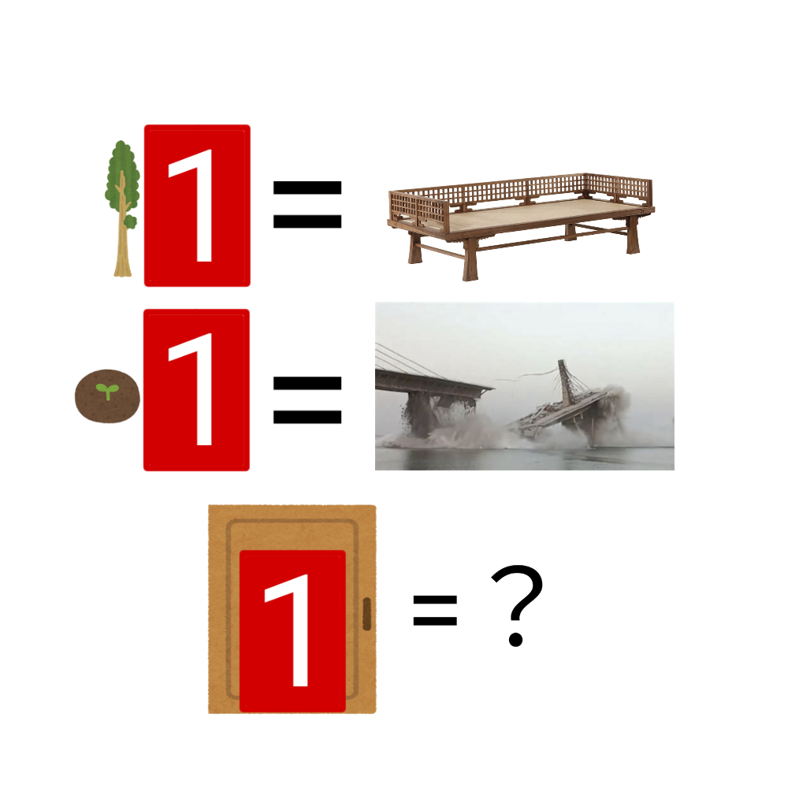

# 千字谜子题 905

## 题面

## 答案

`阘`

## 解析

_官方存档未填写解析。_

## 本地附件

- [09713d56c4884d199e75e43b8e34f5b8.webp](../../../assets/static.cipherpuzzles.com/static/images/09713d56c4884d199e75e43b8e34f5b8.webp)

来源：[https://ccbc16.cipherpuzzles.com/data/c16-qian-puzzle.json#cid=905](https://ccbc16.cipherpuzzles.com/data/c16-qian-puzzle.json#cid=905)
