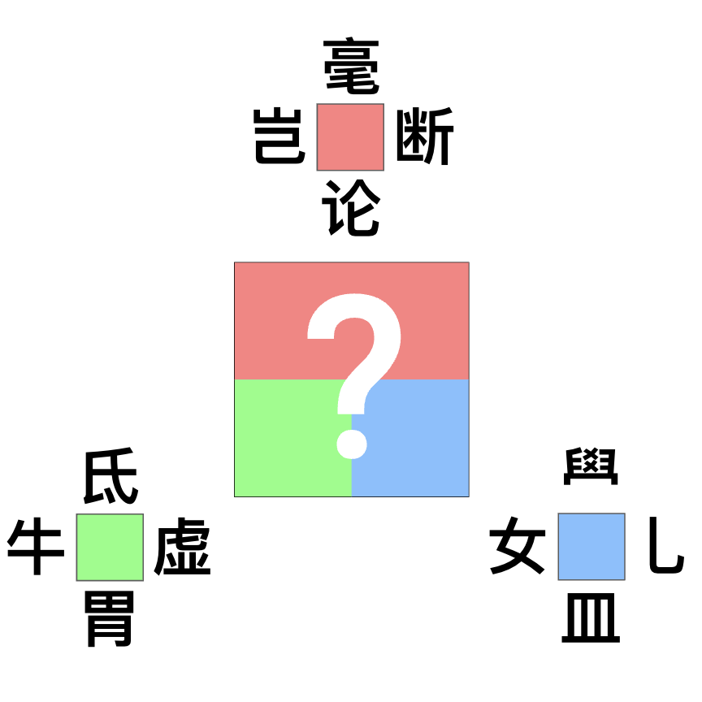

# 千字谜子题 906

## 题面

## 答案

`孬`

## 解析

红色为组词“毫不，岂不，不断，不论”。
绿色为二十八星宿，缺失的部分为“女”。
蓝色为组字，即“孔孟好学”。
组合起来即为“孬”字。

## 本地附件

- [078efbe225d54176b2041a0dfc7be357.webp](../../../assets/static.cipherpuzzles.com/static/images/078efbe225d54176b2041a0dfc7be357.webp)

来源：[https://ccbc16.cipherpuzzles.com/data/c16-qian-puzzle.json#cid=906](https://ccbc16.cipherpuzzles.com/data/c16-qian-puzzle.json#cid=906)
