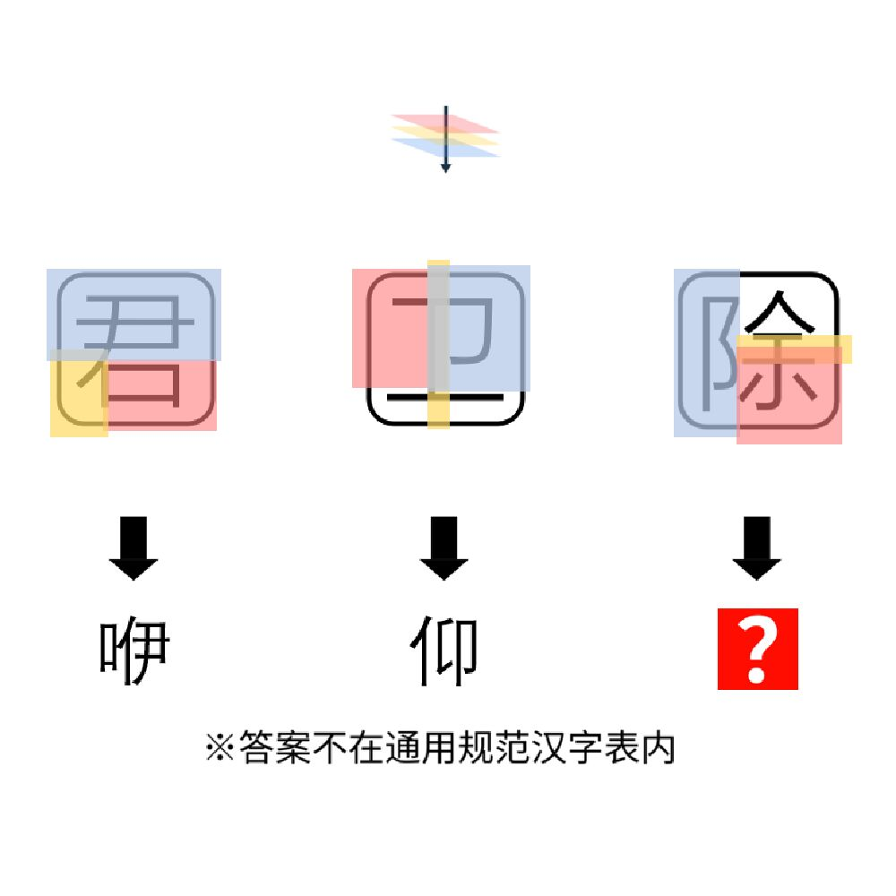

# 千字谜子题 908

## 题面

## 答案

`桏`

## 解析

_官方存档未填写解析。_

## 本地附件

- [fc22e9d51b6741c6be4ad919dbba94ff.webp](../../../assets/static.cipherpuzzles.com/static/images/fc22e9d51b6741c6be4ad919dbba94ff.webp)

来源：[https://ccbc16.cipherpuzzles.com/data/c16-qian-puzzle.json#cid=908](https://ccbc16.cipherpuzzles.com/data/c16-qian-puzzle.json#cid=908)
