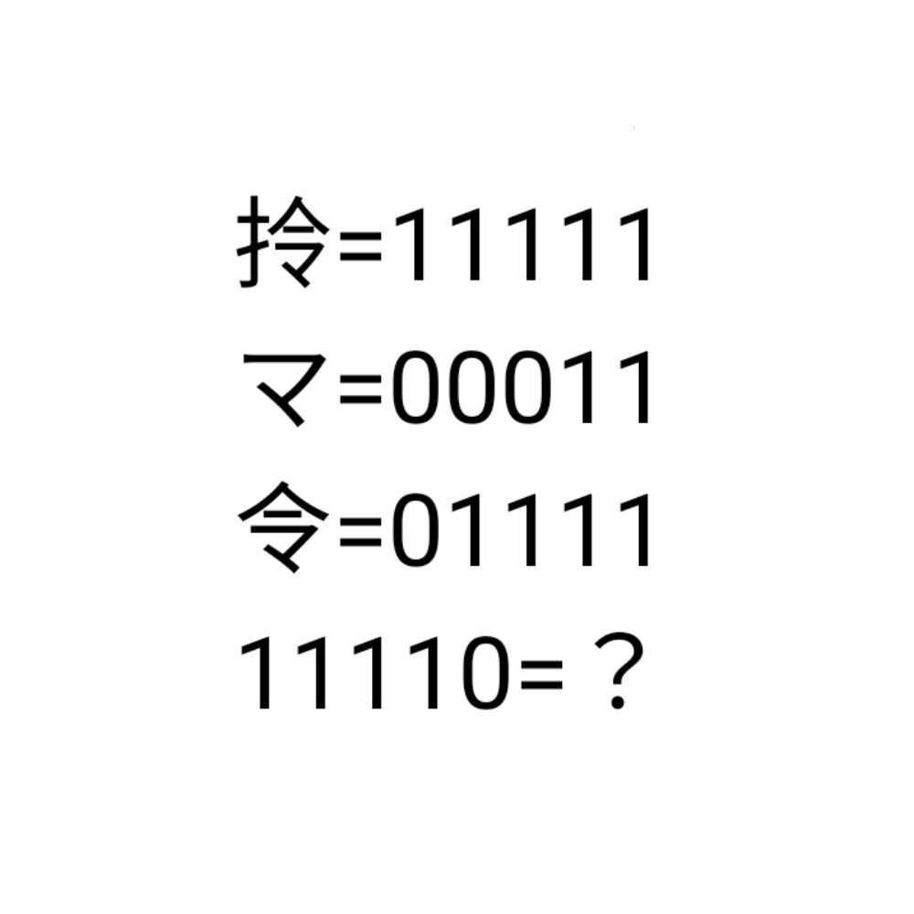

# 千字谜子题 910

## 题面

## 答案

`扲`

## 解析

_官方存档未填写解析。_

## 本地附件

- [9529674668114ac89a6108b617b0f16e.webp](../../../assets/static.cipherpuzzles.com/static/images/9529674668114ac89a6108b617b0f16e.webp)

来源：[https://ccbc16.cipherpuzzles.com/data/c16-qian-puzzle.json#cid=910](https://ccbc16.cipherpuzzles.com/data/c16-qian-puzzle.json#cid=910)
