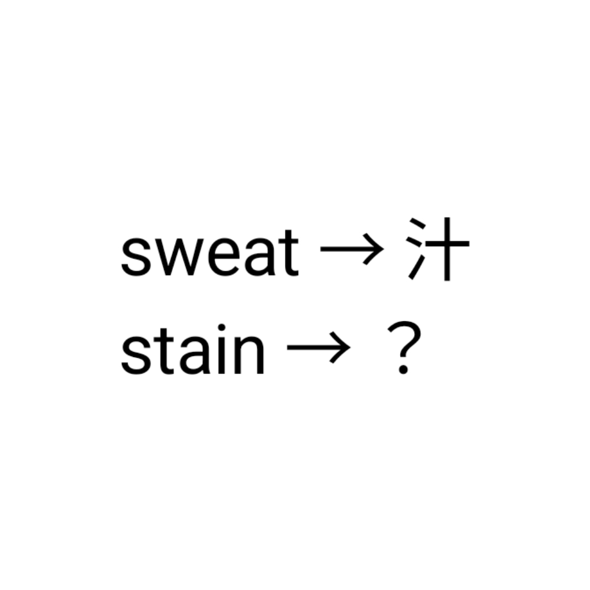

# 千字谜子题 911

## 题面

## 答案

`汅`

## 解析

例子为汗-汁，去掉右上的一横。同理得污-汅。

## 本地附件

- [236697156504497988811d9acc51d59f.webp](../../../assets/static.cipherpuzzles.com/static/images/236697156504497988811d9acc51d59f.webp)

来源：[https://ccbc16.cipherpuzzles.com/data/c16-qian-puzzle.json#cid=911](https://ccbc16.cipherpuzzles.com/data/c16-qian-puzzle.json#cid=911)
