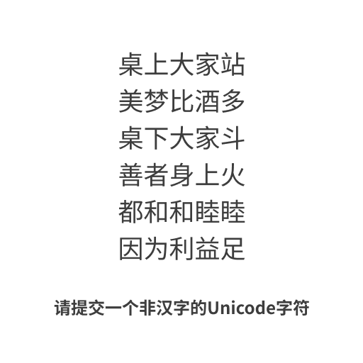

# 千字谜子题 914

## 题面

《八方谜》

## 答案

`䷽`

## 解析

因为作者是揽八，所以这是一道八方谜。
搜索文本可以得到，该文本出自《六爻》，其中副歌每一句分别描述的是天火同人卦，按照是否对于原词取反来取爻，可以得到䷽，即小过卦。

## 本地附件

- [8e68dd6768b94cb5a6f52f1ed0e5fc58.webp](../../../assets/static.cipherpuzzles.com/static/images/8e68dd6768b94cb5a6f52f1ed0e5fc58.webp)

来源：[https://ccbc16.cipherpuzzles.com/data/c16-qian-puzzle.json#cid=914](https://ccbc16.cipherpuzzles.com/data/c16-qian-puzzle.json#cid=914)
