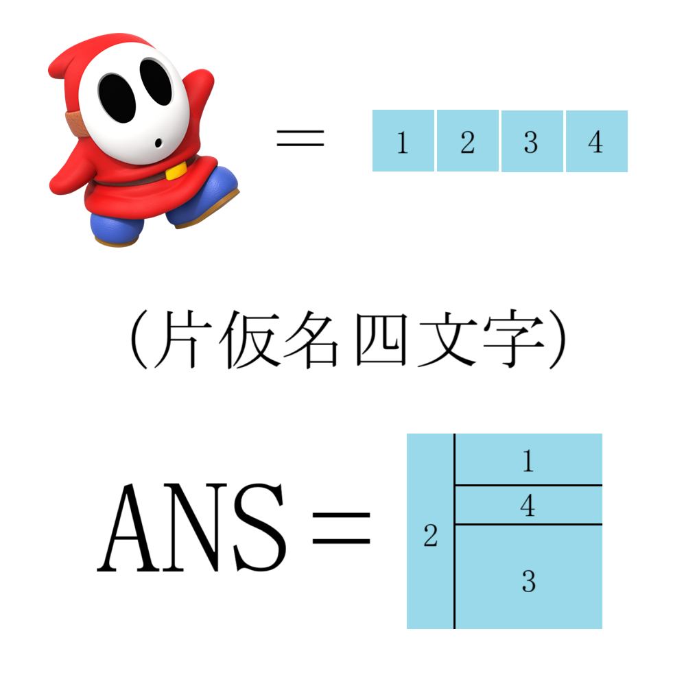

# 千字谜子题 915

## 题面

## 答案

`俆`

## 解析

片假名是 ヘイホー，重组为 俆

## 本地附件

- [3b0c67fdc26b4073bba6ae24cd25110b.webp](../../../assets/static.cipherpuzzles.com/static/images/3b0c67fdc26b4073bba6ae24cd25110b.webp)

来源：[https://ccbc16.cipherpuzzles.com/data/c16-qian-puzzle.json#cid=915](https://ccbc16.cipherpuzzles.com/data/c16-qian-puzzle.json#cid=915)
