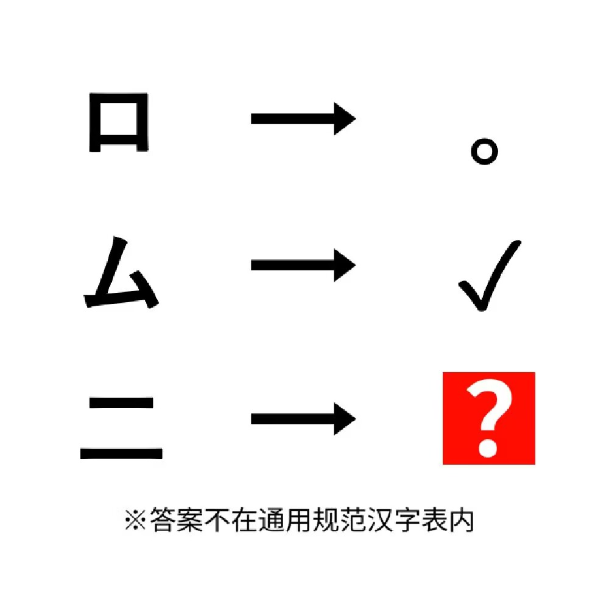

# 千字谜子题 916

## 题面

## 答案

`勻`

## 解析

_官方存档未填写解析。_

## 本地附件

- [b9be9268f7a84d6c8413c1cafbe4e300.webp](../../../assets/static.cipherpuzzles.com/static/images/b9be9268f7a84d6c8413c1cafbe4e300.webp)

来源：[https://ccbc16.cipherpuzzles.com/data/c16-qian-puzzle.json#cid=916](https://ccbc16.cipherpuzzles.com/data/c16-qian-puzzle.json#cid=916)
