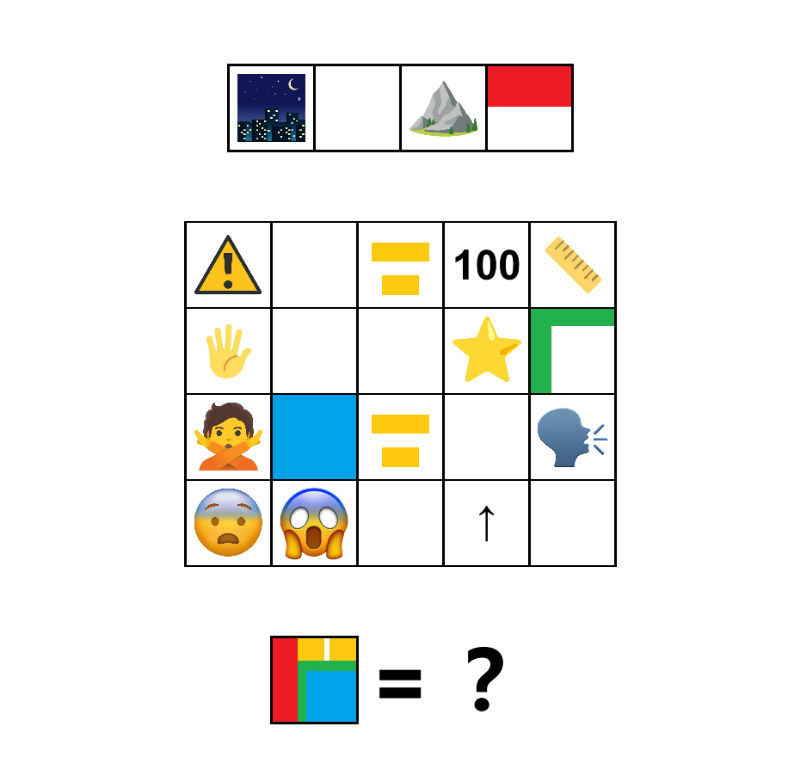

# 千字谜子题 917

## 题面

## 答案

`壧`

## 解析

夜宿山寺
危楼高百尺
手可摘星辰
不敢高声语
恐惊天上人
按颜色提取

## 本地附件

- [a1a2bc38f4d14c48b7839efb927b683f.webp](../../../assets/static.cipherpuzzles.com/static/images/a1a2bc38f4d14c48b7839efb927b683f.webp)

来源：[https://ccbc16.cipherpuzzles.com/data/c16-qian-puzzle.json#cid=917](https://ccbc16.cipherpuzzles.com/data/c16-qian-puzzle.json#cid=917)
