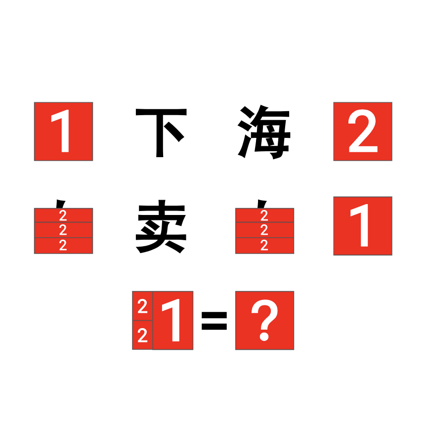

# 千字谜子题 918

## 题面

## 答案

`晇`

## 解析

由前两行成语分别得到“夸下海口”和“自卖自夸”，将部件组合后得到答案晇。

## 本地附件

- [edcccba0683c493c85b58cdd724f8132.webp](../../../assets/static.cipherpuzzles.com/static/images/edcccba0683c493c85b58cdd724f8132.webp)

来源：[https://ccbc16.cipherpuzzles.com/data/c16-qian-puzzle.json#cid=918](https://ccbc16.cipherpuzzles.com/data/c16-qian-puzzle.json#cid=918)
