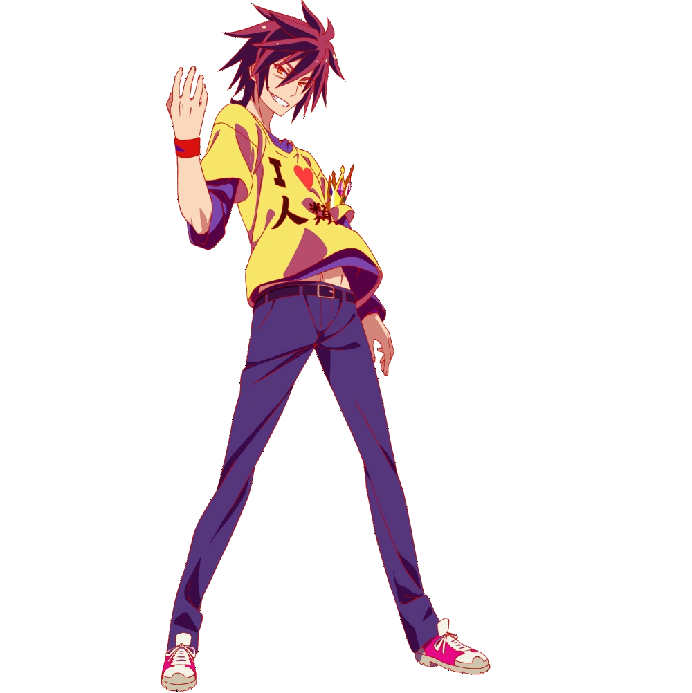

# 千字谜子题 92

## 题面

## 答案

`空`

## 解析

搜图可得，这是动漫人物【游戏人生】的空

## 本地附件

- [e833f6afd62b460eb58975f0bc9c08d4.webp](../../../assets/static.cipherpuzzles.com/static/images/e833f6afd62b460eb58975f0bc9c08d4.webp)

来源：[https://ccbc16.cipherpuzzles.com/data/c16-qian-puzzle.json#cid=92](https://ccbc16.cipherpuzzles.com/data/c16-qian-puzzle.json#cid=92)
