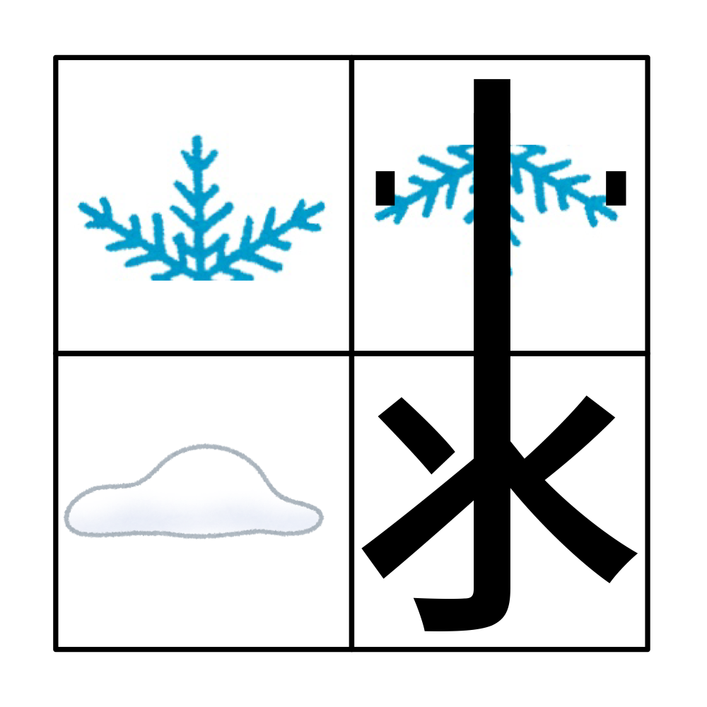

# 千字谜子题 920

## 题面

## 答案

`霴`

## 解析

_官方存档未填写解析。_

## 本地附件

- [ec17315b79f640ecbd472089a3724887.webp](../../../assets/static.cipherpuzzles.com/static/images/ec17315b79f640ecbd472089a3724887.webp)

来源：[https://ccbc16.cipherpuzzles.com/data/c16-qian-puzzle.json#cid=920](https://ccbc16.cipherpuzzles.com/data/c16-qian-puzzle.json#cid=920)
